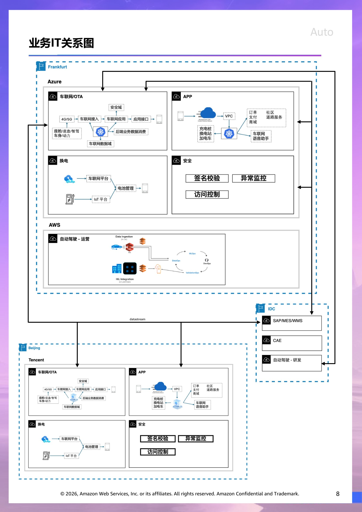
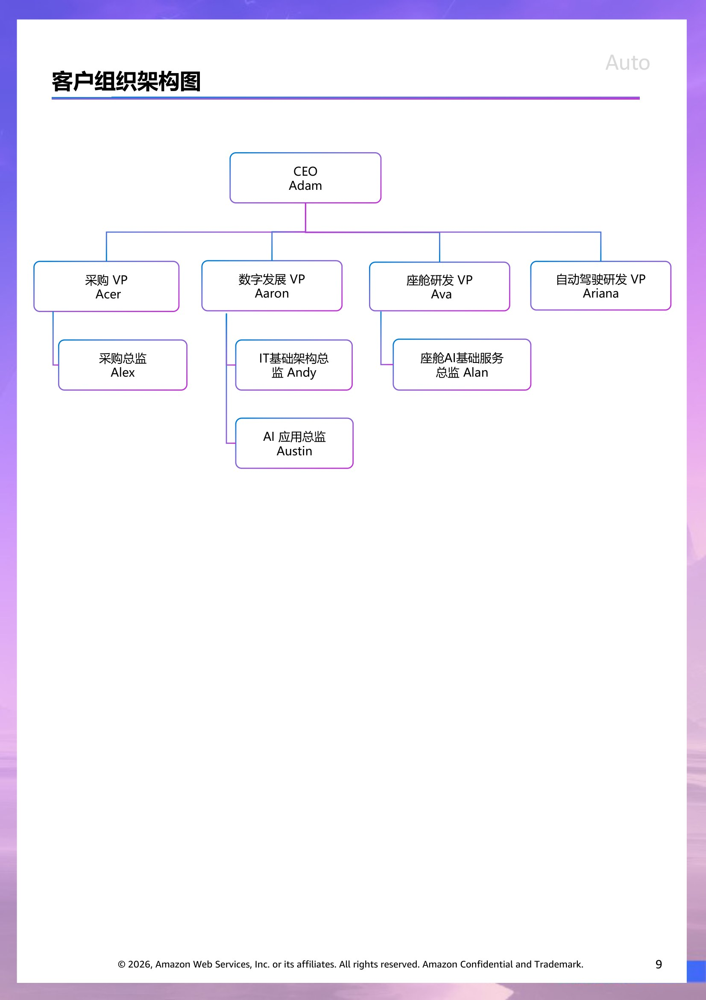

# 客户情报 - AUTO

> 此文档面向 Account Team & Manager,所有人可见。
> 内容来源:原 PPT 客户情报章节 (slide 1 至 Roleplay 起始页之前)。

## 客户背景信息  (slide 2)

蔚来汽车是全球智能电动汽车市场的先驱和领军企业, 并将自己视为一家创新科技与卓越体验相结合的用户企业。 A公司设计、开发、制造和销售智能电动汽车，推动下一代核心技术的创新, 通过持续的技术突破和创新、卓越的产品和服务，以及共同成长的社区来彰显自身特色。

蔚来汽车设计、开发、制造并销售 CXD 品牌的高端智能电动汽车、家庭导向型智能电动汽车，以及小型高端智能电动汽车。目前在中国、欧洲和其他市场提供产品和服务，并计划扩展到更多全球市场，以把握快速增长的电动汽车需求。

在 CXD 品牌下，于2015年推出了XD3000超级跑车，当时这是最快的电动汽车，创下了纽博格林北环赛道全电动车圈速记录。从2016年开始，他们推出并不断迭代一系列定位明确的车型，建立了具有竞争力的产品组合，包括六座智能电动旗舰SUV；中大型五座智能电动SUV；五座全能智能电动SUV；五座智能电动旗舰轿跑SUV；五座智能电动轿跑SUV；智能电动行政旗舰；智能电动行政轿车；中型智能电动轿车；智能电动旅行车。

在2024年，完成了对整个产品组合的全面升级，提供了增强的智能座舱体验。凭借精致的设计、高性能、卓越的舒适性和先进的数字系统，产品组合准确满足了用户在家庭、商务和休闲出行方面的多样化需求。2024年新车发布会上，正式推出了一款智能电动行政旗舰，整合了CXD在12个领域的全栈技术能力，在设计、空间、舒适性、音响、智能系统、辅助和智能驾驶、安全性、动力总成以及整体驾乘性能方面为用户提供旗舰体验。

客户财务基本情况

|  | 2022 | 2023 | 2024 |
| --- | --- | --- | --- |
| Revenues | 49,268,561 | 55,617,933 | 65,731,559 |
| Vehicle sales | 45,506,581 | 49,257,270 | 58,234,086 |
| Other sales | 3,761,980 | 6,360,663 | 7,497,473 |
|  |  |  |  |
| Cost of Sales | (44,124,568) | (52,566,137) | (59,238,797) |
| Gross Profit | 5,143,993 | 3,051,796 | 6,492,762 |
| Operating Expense | (20,784,652) | (25,706,980) | (28,366,835) |
| Net Loss | (14,437,104) | (20,719,753) | (22,401,709) |
|  |  |  |  |
|  |  |  |  |
|  |  |  |  |
|  | *单位：人民币千元 |  |  |

## 财务分析  (slide 3)

收入

蔚来汽车的收入从2023年的556.18亿元人民币增长18.2%至2024年的657.32亿元人民币（约90.05亿美元），主要归因于：(i) 车辆销售增加89.77亿元人民币，这是由于车辆交付量增加38.7%，但部分被产品组合变化导致的车辆平均售价下降所抵消；(ii) 来自零部件、配件和售后车辆服务以及提供电力解决方案的其他收入增加14.97亿元人民币，这是由于我们的用户数量持续增长； (iii) 这些增长部分被二手车销售收入减少5.88亿元人民币所抵消。

销售成本

我们的销售成本从2023年的525.66亿元人民币增加12.7%至2024年的592.39亿元人民币（约81.16亿美元），主要归因于：(i) 车辆销售成本增加65.07亿元人民币，这是由于车辆交付量增加38.7%，但部分被每辆车的材料成本降低和产品组合变化所抵消；(ii) 提供电力解决方案和零部件、配件以及售后车辆服务的成本增加8.40亿元人民币，这是由于我们对电力和服务网络投资增加导致的折旧和运营成本上升； (iii) 这些增长部分被二手车销售成本减少7.46亿元人民币所抵消，这是由于二手车销售量下降导致的结果。

毛利和毛利率

蔚来汽车毛利从2023年的30.52亿元人民币大幅增长112.8%至2024年的64.93亿元人民币（约8.90亿美元）。与2023年相比，毛利增长主要由以下因素驱动：(i) 车辆销售利润增加24.70亿元人民币，主要是由于车辆交付量增加38.7%；(ii) 零部件、配件和售后车辆服务销售利润增加8.50亿元人民币。

2024年的总体毛利率为9.9%，相比2023年的5.5%有显著提升。毛利率的提高主要由车辆毛利率的增长驱动。

2024年的车辆毛利率为12.3%，相比2023年的9.5%有所提高。车辆毛利率是指新车销售的毛利率，仅基于新车销售产生的收入和销售成本计算。与2023年相比，车辆毛利率的提高主要由每辆车的材料成本降低驱动，但部分被产品组合变化所抵消。

> 演讲者备注:Revenues
Our revenues increased by 18.2% from RMB55,617.9 million in 2023 to RMB65,731.6 million (US$9,005.2 million) in 2024,
primarily attributable to (i) an increase in vehicle sales by RMB8,976.8 million, as a result of an increase in vehicle delivery volume by
38.7%, partially offset by a decrease in the average selling price of our vehicles mainly due to changes in product mix, and (ii) an
increase in other revenues by RMB1,497.1 million from sales of parts, accessories and after-sales vehicle services and provision of
power solutions, as a result of continued growth in the number of our users, partially offset by (iii) the decrease in revenue from sales of
used cars by RMB587.8 million.
Cost of sales
Our cost of sales increased by 12.7% from RMB52,566.1 million in 2023 to RMB59,238.8 million (US$8,115.7 million) in
2024, primarily attributable to (i) an increase in cost of vehicle sales by RMB6,507.0 million, as a result of an increase in vehicle
delivery volume by 38.7%, partially offset by lower material cost per vehicle and changes in our product mix, and (ii) an increase in cost
of provision of power solutions and parts, accessories and after-sales vehicle services by RMB840.1 million, as a result of higher
depreciation and operating cost from the increased investment in our power and service network, partially offset by (iii) the decrease in
cost of used car sales of RMB746.4 million, as a result of decreased used car sales volume.
Gross Profit and Gross Margin
Our gross profit increased by 112.8% from RMB3,051.8 million in 2023 to RMB6,492.8 million (US$889.5 million) in 2024.
The increase of gross profit compared to 2023 was mainly driven by (i) the increase in profit from vehicle sales of RMB2,469.8 million
primarily due to an increase in vehicle delivery volume by 38.7%, and (ii) the increase in profit from sales of parts, accessories and after-
sales vehicle services with RMB850.1 million.
Gross margin in 2024 was 9.9%, compared with 5.5% in 2023. The increase of gross margin as compared to 2023 was mainly
driven by the increase of vehicle margin.
Vehicle margin in 2024 was 12.3%, compared with 9.5% in 2023. Vehicle margin is the margin of new vehicle sales, which is
calculated based on revenues and cost of sales derived from new vehicle sales only. The increase of vehicle margin as compared to 2023
was mainly driven by decreased material cost per vehicle, which is partially offset by changes in our product mix.
Other sales margin in 2024 was negative 8.6%, compared with negative 25.4% in 2023, which was mainly driven by the
increase of sales of parts, accessories and after-sales vehicle services with relatively high sales margin.

## 业务挑战  (slide 4)

多维度经营压力

蔚来汽车当前面临销售疲软、成本结构不合理及盈利能力持续受损的多重挑战。2025年第一季度，受季节性需求波动及核心产品线更迭双重影响，蔚来汽车累计交付量仅达3.5万台，显著低于主要竞争对手的市场表现。战略性品牌月均销量维持在5000台以下水平，尽管公司大幅扩充销售网络及营销资源投入，却未能实现预期的销售转化率。

蔚来汽车长期坚持"价值投资"战略，在技术研发、产品创新、服务体系及用户生态等多个领域进行前瞻性投入，致力于构建差异化竞争优势。然而，持续扩张的成本结构与不相匹配的收入增长之间的结构性矛盾日益凸显，资本市场对"长期价值投资何时能转化为实质性财务回报"的质疑达到前所未有的高度。

组织架构重构与效能提升

面对经营压力，蔚来汽车加速实施全公司范围的组织重构计划，明确设定2025年第四季度实现单季度盈利的战略目标。公司引入基础经营单元管理体系，将业务体系分解为多个独立核算的经营单元，每个单元均需建立明确的业绩指标、成本控制目标及投资回报率要求。组织结构随之优化，建立了横跨产品规划、研发创新、工业化实施及用户服务的"产品线"矩阵式组织，使产品线总经理对产品全生命周期的经营绩效承担完整责任，有效解决了传统垂直部门协同效率低下的问题。同时，公司持续推进组织精简与人员优化，包括对高级管理层与专业技术岗位进行结构性调整。

从理念固化到务实高效

蔚来汽车凭借其坚守核心理念的特色，在行业内形成了独特的定位，如坚持"需求驱动生产"而非"库存驱动销售"的运营模式，导致多次错失新产品上市的市场窗口期。经历A60的产能爬坡与交付延迟问题后，公司开始调整战略思路，更加注重市场规律，确保新款产品能够实现"发布即交付"的市场承诺。

在产品策略层面，蔚来汽车从"内在价值导向"转向"感知价值优先"，更加注重用户体验与市场反馈。新一代产品系统性优化了低感知度的功能配置，将资源集中于用户高度重视的产品特性上，实现了"配置升级而成本优化"的双重目标。

精细化运营与成本管控

Adam提出"百万倍成本效应"理念，要求管理团队将每项成本支出放大至百万量级进行评估，审视其投入产出比。公司成立专门的成本管理委员会，系统性推进降本增效方案，并建立实时监控的成本管理仪表盘。研发项目立项流程显著优化，约50%的提案项目未能通过投资回报评估，确保有限资源集中投入到具有明确商业价值的核心项目。各职能部门实施工时管理制度，量化评估人力资源对项目的实际贡献，提升员工对时间成本的敏感度。

尽管这场战略转型面临诸多挑战与阵痛，但蔚来汽车已别无选择。正如Adam所强调的："我们必须实现与时间的赛跑，与自身惯性的赛跑"，唯有如此，才能为公司创造可持续的价值重建机会。

> 演讲者备注:Revenues
Our revenues increased by 18.2% from RMB55,617.9 million in 2023 to RMB65,731.6 million (US$9,005.2 million) in 2024,
primarily attributable to (i) an increase in vehicle sales by RMB8,976.8 million, as a result of an increase in vehicle delivery volume by
38.7%, partially offset by a decrease in the average selling price of our vehicles mainly due to changes in product mix, and (ii) an
increase in other revenues by RMB1,497.1 million from sales of parts, accessories and after-sales vehicle services and provision of
power solutions, as a result of continued growth in the number of our users, partially offset by (iii) the decrease in revenue from sales of
used cars by RMB587.8 million.
Cost of sales
Our cost of sales increased by 12.7% from RMB52,566.1 million in 2023 to RMB59,238.8 million (US$8,115.7 million) in
2024, primarily attributable to (i) an increase in cost of vehicle sales by RMB6,507.0 million, as a result of an increase in vehicle
delivery volume by 38.7%, partially offset by lower material cost per vehicle and changes in our product mix, and (ii) an increase in cost
of provision of power solutions and parts, accessories and after-sales vehicle services by RMB840.1 million, as a result of higher
depreciation and operating cost from the increased investment in our power and service network, partially offset by (iii) the decrease in
cost of used car sales of RMB746.4 million, as a result of decreased used car sales volume.
Gross Profit and Gross Margin
Our gross profit increased by 112.8% from RMB3,051.8 million in 2023 to RMB6,492.8 million (US$889.5 million) in 2024.
The increase of gross profit compared to 2023 was mainly driven by (i) the increase in profit from vehicle sales of RMB2,469.8 million
primarily due to an increase in vehicle delivery volume by 38.7%, and (ii) the increase in profit from sales of parts, accessories and after-
sales vehicle services with RMB850.1 million.
Gross margin in 2024 was 9.9%, compared with 5.5% in 2023. The increase of gross margin as compared to 2023 was mainly
driven by the increase of vehicle margin.
Vehicle margin in 2024 was 12.3%, compared with 9.5% in 2023. Vehicle margin is the margin of new vehicle sales, which is
calculated based on revenues and cost of sales derived from new vehicle sales only. The increase of vehicle margin as compared to 2023
was mainly driven by decreased material cost per vehicle, which is partially offset by changes in our product mix.
Other sales margin in 2024 was negative 8.6%, compared with negative 25.4% in 2023, which was mainly driven by the
increase of sales of parts, accessories and after-sales vehicle services with relatively high sales margin.

## 行业趋势  (slide 5)

随着全球对环境保护和可持续发展的重视，新能源汽车行业迎来了前所未有的发展机遇。中国作为新能源汽车市场的领头羊，近年来在产销量、技术创新、政策推动等方面均取得了显著成就。2025年，中国新能源汽车行业正站在新的历史起点上，面临更加激烈的市场竞争和广阔的发展前景。

一、行业现状：从爆发增长到结构性升级

2025年注定载入全球汽车工业史册——中国新能源汽车年销量突破1600万辆大关，国内市场渗透率达51%，首次实现对燃油车的全面超越。根据中研普华产业研究院发布的《2025-2030年中国新能源汽车行业竞争分析及发展前景预测报告》显示，过去五年行业复合增长率达42%，市场规模突破3800亿美元，相当于德国整个汽车产业规模的1.8倍。技术路线分化呈现新特征：插混/增程车型占比从2020年18%跃升至50%，成功打开下沉市场突口;800V高压平台车型渗透率突破30%，15分钟补能400公里成为主流配置。值得关注的是，固态电池量产车型开始交付，能量密度突破400Wh/kg，较传统锂电提升50%，这标志着动力电池技术进入迭代前夜。

二、竞争图谱：四强争霸与生态重构

当前市场格局呈现「一超多强」特征：比亚迪以26.9%市占率稳居榜首，特斯拉、吉利、长安构成第二梯队，鸿蒙智行、小米汽车等新势力凭借智能化生态实现弯道超车。值得关注的是，TOP10厂商集中度达79.8%，尾部品牌淘汰速度加快，年销不足20万辆的车企面临生存危机。

差异化竞争策略：

全产业链掌控者(比亚迪)：垂直整合模式构建护城河，刀片电池外供比例提升至35%，半导体业务估值超千亿

科技赋能派(华为、小米)：HI全栈解决方案装机量突破200万，智能座舱用户日均交互次数达27次

场景化专家(理想、问界)：家庭出行场景车型市占率达41%，用户复购率超60%

出海先行军(奇瑞、上汽)：海外工厂本地化率突破60%，成功规避欧盟35.3%关税壁垒

中研普华数据显示，2025年1月新能源出口均价突破3.5万美元，较三年前提升82%，印证中国车企品牌升级成效。

三、技术革命：智能化开启第二增长曲线

当电动化进入平台期，智能化正成为新的角力场。行业呈现三大突破：

智驾平权加速：15万级车型NOA标配率达28%，激光雷达成本降至120美元，较2022年下降90%

能源网络革命：宁德时代「巧克力换电」单站日服务能力达300车次，度电成本下降40%;V2G技术创造单车年均收益3200元

电子电气架构跃迁：中央计算+区域控制架构占比达45%，整车线束长度减少70%

值得关注的是，大模型上车引发交互革命，小鹏XNGP系统复杂场景接管间隔里程突破800公里，较上年提升3倍。

> 演讲者备注:Reseach

## 客户现有战略方向  (slide 6)

多品牌战略的精准定位

蔚来汽车正在构建一个多元化的品牌矩阵，以满足不同细分市场的需求。高端旗舰品牌将继续引领豪华电动车市场；全新推出的品牌专注于智能电动高端小型车领域，以精致设计和智能科技吸引年轻消费者；而EXD则瞄准家庭用户市场，提供实用且智能的出行解决方案。这种多品牌战略使蔚来汽车能够在不同价格区间和细分市场中建立强大存在。

产品创新与技术突破

2025年将是蔚来汽车的"产品大年"，公司计划从四月起密集发布新产品，涵盖旗下三大品牌。豪华旗舰车型将在一季度开始交付，同时现有热门车型将进行全面升级，注入更多创新科技。

在技术领域，蔚来汽车正在推动多项前沿突破。其基于大模型架构的智能安全辅助系统将迎来重大升级，新增自动紧急避让(AES)和通用障碍物预警及辅助(GOA)等功能。更令人瞩目的是，蔚来汽车已成功流片业界首款采用5nm车规工艺制造的智能驾驶芯片，并发布了整车全域操作系统，展现了公司在核心技术上的自主创新能力。

基础设施建设与能源解决方案

蔚来汽车独特的换电站网络正在全国范围内加速扩张。到2025年6月底，公司计划完成14个省级行政区、超过1200个县级行政区的"换电县县通"工程；年底前，将再新增13个省级行政区的覆盖。2026年，蔚来汽车将继续攻坚其余省份的换电站建设，打造全国最便捷的电动车能源补给网络。

全球化战略布局

蔚来汽车的全球化步伐正在加速。新品牌计划在中国和欧洲市场同步上市，展现公司的国际化雄心。在中东地区，蔚来汽车已与战略伙伴签署合作协议，将在阿联酋阿布扎比建立先进技术研发中心，专注于智能驾驶与人工智能技术研发。通过合资企业，蔚来汽车将以阿联酋为首发市场，迅速拓展中东和北非业务。在欧洲，公司计划于2025年上半年推出新品牌，并加快换电站网络建设。

财务目标与盈利规划

蔚来汽车设定了明确的财务目标：2025年销量计划增加至40万辆，同时将毛利率从现有的15%提升至20%，部分品牌毛利率预计从10%提高至15%。更为关键的是，公司计划在2026年实现整体盈利，净亏损将大幅收窄甚至转为盈利，标志着蔚来汽车将进入发展的新阶段。

通过这一系列战略举措，蔚来汽车正在从一家中国高端电动车制造商转变为全球智能电动出行解决方案提供者，以创新科技和用户体验为核心，构建面向未来的可持续发展模式。

## 行业趋势  (slide 7)

四、挑战与破局：穿越周期迷雾

行业高增长背后暗藏三大隐忧：

盈利困局：价格战导致行业销售利润率降至4.4%，较传统燃油车低1.8个百分点

基础设施错配：三四线城市公共充电桩利用率不足15%，制约市场下沉

技术迭代风险：固态电池量产引发锂电资产减值压力，行业存货周转天数增加至68天

破局之道在于「技术降本+生态协同」：比亚迪CTB电池底盘一体化技术降低物料成本18%，「电区房」覆盖率提升至63%，车能路云一体化试点项目已减少电网峰谷差14%。

五、未来十年：从中国速度到全球标准

中研普华产业研究院预测，2030年行业将呈现三大趋势：

市场格局：形成3-5家千万级销量集团，智能汽车软件收入占比超30%

技术方向：钠离子电池实现A0级车型全覆盖，L4自动驾驶开放道路测试里程占比达40%

全球化布局：海外生产基地贡献50%以上出口量，中国标准充电协议覆盖70个国家

值得投资者关注的是，车规芯片、线控底盘、智能座舱三大赛道未来五年复合增长率将达58%，远超整车制造环节。

站在2025年这个历史性节点，中国新能源汽车产业正经历从规模扩张向质量提升的关键转型。中研普华产业研究院持续监测显示，那些在智能化研发投入占比超8%、海外本地化运营体系健全、用户数据资产超500TB的企业，更有可能穿越周期成为最终赢家。在这个「软件定义汽车」的新时代，行业竞争终将回归「用户体验价值创造」的本质逻辑。

客户的现有 IT 供应商情况

|  | 供应商 | 供应商 |
| --- | --- | --- |
| 车联网 | 腾讯云 | Azure |
| 能源交换 | 腾讯云 | Azure |
| 自动驾驶 | IDC | AWS |
| SAP | IDC |  |
| CAE | IDC |  |
|  |  |  |
|  |  |  |
|  |  |  |

> 演讲者备注:Reseach

## 业务IT关系图  (slide 8)

> 演讲者备注:目前不清楚内部的自建云架构不清楚

## 客户组织架构图  (slide 9)

> 演讲者备注:Aaron, Austin, Andrew, Allen, Alan, Alex, Angel, Arthur, Anna, Ariana, Ava, Allison
