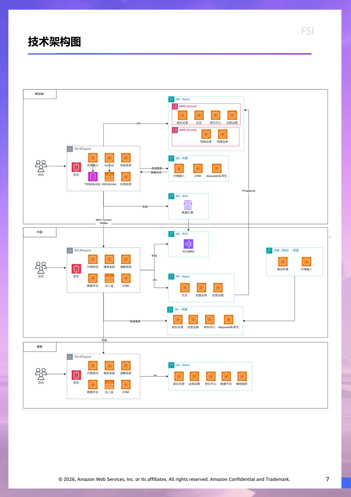
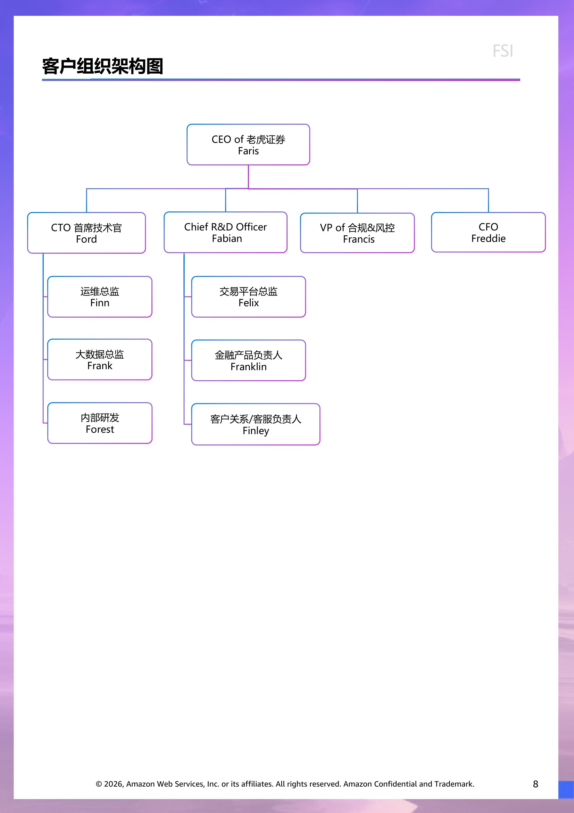

# 客户情报 - FSI

> 此文档面向 Account Team & Manager,所有人可见。
> 内容来源:原 PPT 客户情报章节 (slide 1 至 Roleplay 起始页之前)。

## 客户背景信息  (slide 2)

老虎证券成立于2015年，致力于成为全球一流的科技券商。在新的时代，投资全球不该是天方夜谭，技术的革新下应该诞生更好用的交易软件、更友好的社区交流和服务，让投资变得再轻松、简单、智能一些。这就是老虎证券正在做的事情，老虎证券希望通过科技提高金融效率，让更多人能享受投资的乐趣。

2016年推出自主研发的交易平台F-Trade，改善了全球华人投资美股时开户复杂、费率高、软件体验差、没有本地化服务等痛点，迅速成为了深受华人喜爱的投资平台。 2017年5月，上线美股IPO申购服务，打破了机构及高净值人群对美股新股申购的垄断。老虎证券推出的美股打新服务项目数量致力于领跑业界。现在，投资者在平台可通过一个账户交易美股、港股、A股、新加坡股、澳股、期货、基金等全球主要市场的金融产品，享受一流的投资体验。此外，老虎证券还提供投行、ESOP（股权激励计划）等机构服务以及财富管理、投资者教育等多种增值服务。该公司通过其“移动优先”战略为客户提供创新的产品和服务以及卓越的用户体验，使其能够更好地服务和留住现有客户，并吸引新客户。公司为客户提供全面的经纪和增值服务，包括行情、交易订单的下单和执行、保证金融资、IPO认购、ESOP管理、投资者教育、社区讨论和客户支持。

作为全球知名的互联网券商，老虎证券总部位于新加坡、研发中心位于中国，在多个国家和地区设有办公室，在全球拥有近10001名员工。目前，老虎证券已取得新加坡、美国、新西兰、澳大利亚、中国香港等地的券商牌照或许可，并为当地居民提供证券、衍生品交易等服务。2019年正式在美国纳斯达克交易所挂牌上市。主要收入来自：佣金、手续费、利息。作为第三代券商，领先的技术和研发能力是老虎证券的看家本领。 团队不仅热爱交易，同时也是一群追求极致体验的Geek，近一半的员工为研发人员。老虎证券通过金融科技创新从底层重构交易系统，现自有的技术架构可支持多货币、多市场、多产品的交易，并且具有很高的可访问性、可靠性、高安全性、高扩展性、低延迟性。全自研的技术架构使老虎证券能不断推出更加创新、安全、可靠的产品功能和绝佳的用户体验。

客户财务基本情况

|  | 2022 | 2023 | 2024 |
| --- | --- | --- | --- |
| Total revenues | 225 | 272 | 391 |
| Total net revenues | 206 | 225 | 330 |
| Total operating cost and expenses | 204 | 192 | 252 |
| Execution and clearing | 15 | 9 | 14 |
| Employee compensation and benefits | 101 | 100 | 122 |
| Occupancy, depreciation and amortization | 9 | 9 | 8 |
| Communication and market data | 27 | 30 | 38 |
| Marketing and branding | 33 | 20 | 28 |
| General and administrative | 18 | 21 | 39 |
| Net (loss) income | -2 | 33 | 61 |
| Total Comprehensive (loss) income | -11 | 32 | 52 |
|  | *单位：美元百万元 |  |  |

## 财务分析  (slide 3)

总收入从2023年的2.725亿美元增长43.7%至2024年的3.915亿美元。这一增长主要由佣金和利息收入的显著增加所驱动。

佣金收入

佣金收入在2024年为15.90亿美元，较2023年的9.26亿美元增长71.8%，这主要由用户基础扩大和交易量增加所推动。我们的交易量从2023年的2,942亿美元增加至2024年的5,523亿美元。

融资服务费

融资服务费在2024年为1,130万美元，较2023年的1,220万美元下降7.1%，主要由于我们全面披露账户客户的证券借贷活动减少。融资融券活动的融资服务费从2023年的1,110万美元减少4.6%至2024年的1,060万美元。证券借贷活动的融资服务费从2023年的110万美元减少32.7%至2024年的70万美元。

利息收入

利息收入在2024年为1.918亿美元，较2023年的1.493亿美元上升28.4%。这主要由于融资融券和证券借贷活动增加以及银行存款利息收入增加。证券借贷活动的利息收入从2023年的6,870万美元增长10.2%至2024年的7,570万美元，融资融券活动的利息收入从2023年的5,230万美元增长37.9%至2024年的7,220万美元，这主要归因于日均证券借贷和融资融券活动余额的增加。

其他收入

其他收入在2024年为2,940万美元，较2023年的1,840万美元增长59.6%。这一增长主要由于市场环境更加活跃，导致IPO分销收入和货币兑换服务收入增加。

利息支出

利息支出在2024年为6,080万美元，较2023年的4,700万美元增长29.5%，这是由于融资融券和证券借贷活动余额增加所致。

目前的收入主要来源于经纪业务，包括向客户收取的佣金费用以及由我们自身或第三方为客户提供的融资融券或证券借贷交易服务所产生的利息收入或融资服务费。

佣金收入主要由客户交易产生，其规模主要取决于交易量和佣金费率。我们根据交易金额或每笔订单的股数、手数或合约数量收取佣金。作为营销策略的一部分，我们不时向新客户或现有客户提供折扣甚至零佣金优惠，以此吸引更多客户并提升客户黏性。

收入模式

## 业务挑战  (slide 4)

监管合规压力与政策不确定性

中国内地跨境投资限制：自2023年中国证监会明确禁止境内投资者通过境外券商开展跨境证券交易后，老虎证券已停止新增内地客户开户，仅能服务存量客户。若政策进一步收紧（如限制存量客户交易），其收入来源（佣金、融资利息等）可能大幅萎缩。

香港市场合规成本上升：香港作为老虎证券的核心市场，其金融监管（如证监会《虚拟资产交易平台指引》）可能要求券商增加反洗钱、投资者适当性管理等投入，推高运营成本。

全球监管差异：若拓展其他市场（如东南亚、美国），需应对不同司法管辖区的牌照申请和合规要求，可能拖慢扩张速度。

市场竞争加剧

传统券商与互联网巨头的挤压：香港市场面临富途、辉立等本土券商的直接竞争，以及汇丰、渣打等传统银行的数字化服务分流。互联网平台（如腾讯、阿里旗下金融业务）可能通过更低佣金或生态整合抢占用户。

新兴金融科技公司的挑战：提供零佣金交易、AI投顾等创新服务的公司（如Webull，Robinhood、eToro）可能削弱老虎证券的价格和技术优势。

业务转型与盈利模式的风险

依赖交易佣金的局限性：老虎证券收入高度依赖交易佣金和融资利息，若市场交易量下滑（如港股流动性不足、美股波动性降低），将直接影响营收。

机构业务拓展的难度：尽管老虎证券计划加强投行、ESOP等机构服务，但与传统投行（如高盛、摩根士丹利）相比，其品牌信任度和资源积累仍存差距。

金融科技创新的落地风险：Web3和区块链应用（如证券代币化）需长期投入，且面临技术成熟度、市场接受度和监管审批的多重不确定性。

宏观经济与市场环境波动

全球资本市场的不稳定性：美联储货币政策变化、地缘政治冲突（如中美关系）可能导致美股、港股波动，影响投资者交易活跃度。

香港市场流动性压力：2023年港股日均成交额较峰值下降超30%，若流动性持续低迷，老虎证券的港股相关业务（如IPO承销、交易佣金）将受冲击。

汇率与利率风险：美元/港元汇率波动可能影响以美元结算的营收，而利率上升或增加融资成本。

技术与安全风险

系统稳定性与网络安全：高频交易、数字化服务依赖技术系统，一旦出现宕机或数据泄露（如客户信息被黑客攻击），将严重损害品牌信誉。

AI应用的伦理与合规问题：若采用AI投顾或自动化交易，需确保算法公平性，避免因推荐失误引发法律纠纷。

客户留存与增长瓶颈

存量客户流失风险：内地存量客户若因政策限制或体验不佳转向其他渠道，老虎证券将面临用户基数萎缩。

高净值客户获取难度：香港家族办公室和机构客户更倾向于选择传统私人银行，老虎证券需证明其服务专业性和风控能力。

> 演讲者备注:Reseach

## 行业趋势  (slide 5)

近年来，互联网券商（如老虎证券、富途证券、Webull、eToro等）凭借低佣金、数字化体验、全球化布局等优势迅速崛起，但同时也面临监管收紧、竞争加剧、盈利模式转型等挑战。以下是行业的主要发展趋势：

全球化扩张已成为互联网券商的核心战略。随着欧美市场竞争白热化，这些平台正积极开拓东南亚、中东和拉丁美洲等新兴市场。新加坡、印尼、阿联酋和巴西等地区因其活跃的投资文化和相对宽松的监管环境，成为重要的增长点。然而，全球化布局也带来了更复杂的合规挑战，各国金融监管日益严格，如中国限制跨境证券交易、美国SEC加强对"零佣金"模式的审查，迫使券商投入更多资源获取多地牌照并满足不同的监管要求。

商业模式转型是行业另一显著趋势。"零佣金"交易已成为标准配置，传统佣金收入大幅下滑，促使互联网券商寻求收入多元化。融资融券利息已成为主要收入来源，同时付费数据服务、高级研报和财富管理产品等增值服务比重不断提升。社交化投资功能如eToro的复制交易和富途的"牛牛圈"社区，让用户可以分享投资策略并跟单交易，这不仅提高了用户粘性，也创造了新的盈利模式。

金融科技创新持续推动行业发展。人工智能技术在投资建议、风险评估和自动化交易策略方面的应用日益广泛。部分前沿券商开始探索区块链技术，包括证券型代币(STO)和NFT分红等创新尝试。交易技术不断升级，提供毫秒级低延迟交易和专业量化策略支持，满足日益增长的专业投资者需求。

竞争格局已从早期的"流量战"转向"服务战"。传统金融巨头如高盛(Marcus)和摩根大通(You Invest)通过数字化转型发起反击，推出具有竞争力的在线交易平台。同时，支付宝、微信等互联网巨头也通过基金销售和股票信息服务分流用户。TikTok等社交媒体平台也开始测试金融服务功能，进一步加剧了行业竞争。

随着金融服务机构探索 AI 赋能时代的机会，人工智能在塑造业务战略和运营中所发挥的作用持续扩大。AI 驱动的应用，将涵盖以下用例：提升对 AML/KYC 的身份认证，减少交易欺诈的，生成新的交易策略以提高市场回报，自动化文档管理以缩短融资周期等。大量企业开始利用 AI 创造竞争优势、提升客户体验，并提高员工生产力。这些领域越来越受到关注，因为企业不仅希望使用 AI 节约成本，更希望其助力转型与增长。其中一个最显著的趋势是，有关拓展新业务机会和推动收入增长的目标有所增加，从去年的 7% 增长至今年的 23%。这表明企业进行了战略调整，希望通过 AI 推动更多创收活动，并探索新的市场。

展望未来，互联网券商面临多重挑战与机遇。监管环境的不确定性、零佣金模式下的盈利压力以及用户增长放缓是主要挑战。然而，高净值客户财富管理、企业员工持股计划(ESOP)服务以及合规化的加密货币交易等领域仍存在巨大发展空间。随着行业进入成熟期，服务质量、用户体验和产品创新将成为决定成败的关键因素。

> 演讲者备注:Reseach

## 客户现有战略方向  (slide 6)

老虎证券正从互联网券商向综合性金融科技平台转型，同时在全球市场（尤其是香港）寻求更稳健的增长路径。

强化香港市场布局，拓展机构业务

老虎证券在2025年继续加大香港市场的投入，包括扩大办公规模、增加员工数量，并整合投行、ESOP（员工持股计划）、资产管理等机构业务，以增强与零售业务的协同效应。

整合技术研发、交易结算、客户服务等团队，并计划在未来两年内将香港员工人数翻倍。

香港市场的新入金客户平均净入金超过3万美元，显示高净值客户和家族办公室业务的增长潜力。

聚焦金融科技创新，探索Web3与区块链应用

老虎证券强调科技驱动金融创新，计划推进Web2与Web3融合的金融科技项目，探索区块链技术在证券交易、资产管理和客户服务中的应用。新办公室设有客户互动体验区，用于投资教育活动，并结合线上直播、工作坊等方式提升投资者教育。

应对监管调整，优化存量客户服务

由于中国内地对跨境证券业务的监管收紧，老虎证券已停止新增内地投资者开户，但仍支持存量客户（2023年5月19日前已在其他海外券商开户的投资者）继续交易。公司调整业务模式，避免招揽新客户，但仍通过存量客户维持市场份额。

提升港股、美股交易服务，增强竞争力

老虎证券在香港市场推出独家美股“打新”项目，并优化交易体验，如提高中签率（例如中国茶饮公司霸王茶姬IPO的中签率在券商中最高）。同时，公司继续支持港股、美股、ETF、衍生品等多市场交易，以满足全球投资者的需求。

关注政策变化，优化合规与市场适应性

老虎证券对香港2025年财政预算案中关于交易机制现代化（如T+1结算、交易单位调整）的政策表示关注，认为这将提升市场流动性并降低交易成本。公司对短期市场波动保持警惕，但长期看好香港作为国际金融中心的地位。

客户的现有 IT 供应商情况

|  | 供应商 | 供应商 |
| --- | --- | --- |
| 交易系统 （核心应用） | IDC |  |
| 数仓系统 | 华为云 |  |
| 呼叫中心业务 | Azure |  |
| 行情分发 | IDC |  |
| 社区系统 | Azure |  |
| AI Studio | 阿里云 |  |
| CRM | IDC | 阿里云 |
|  |  |  |

## 技术架构图  (slide 7)

> 演讲者备注:目前不清楚内部的自建云架构不清楚

## 客户组织架构图  (slide 8)

> 演讲者备注:Fitz, Francisco, Felipe, Fox
