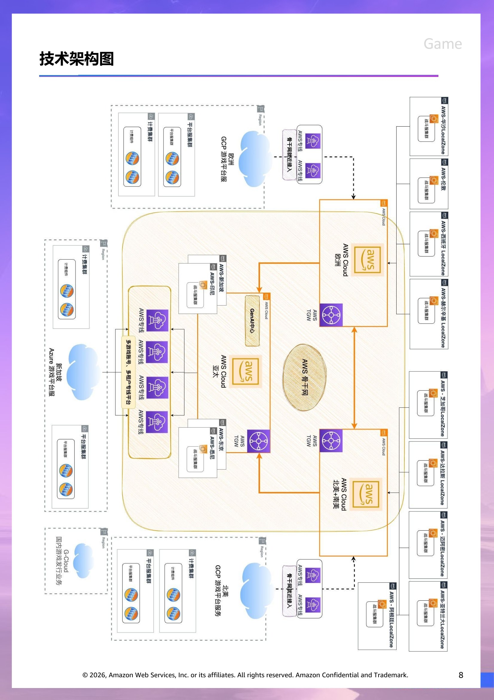
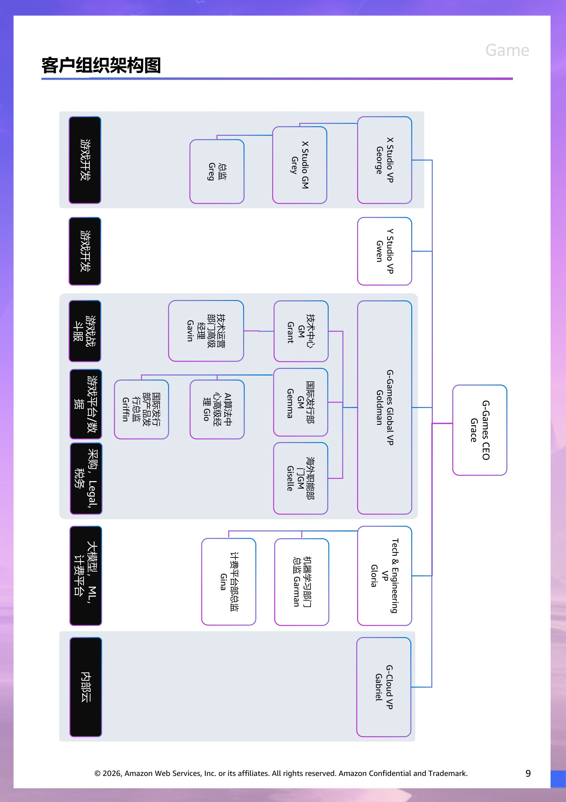

# 客户情报 - GAME

> 此文档面向 Account Team & Manager,所有人可见。
> 内容来源:原 PPT 客户情报章节 (slide 1 至 Roleplay 起始页之前)。

## 客户背景信息  (slide 2)

腾讯是一个集团化公司，组织架构划分为六大Business Group： IM生态部 (Instant Messaging)，营收以广告为主；Media & 社交网络部，营收以增值服务为主，视频，音乐等会员，少量广告营收；游戏业务，营收以增值服务为主，少量广告营收，全球头部游戏研发商和发行商；云与AI产业部，是国内头部公有云和AI服务商，集团内业务优先使用自己的云和AI，并享受成本价；广告和金融科技部，提供广告平台和金融科技服务；技术工程部，主要为各大业务提供技术服务，也是集团的技术委员会，统一标准，并大量投入云平台建设运营及AI能力的提升。

该公司的核心业务在国内属于头部业务，规模庞大，且牵涉到社交和金融，面临着国家的强监管和社会责任。大部分营收来自于国内，与国内的经济和消费有着重要的关联。因此，公司希望逐步在部分业务上开拓国际市场，提升国际市场的营收，同时持续驱动科技进步，赋能业务，提升效率和转换率。

企业责任相关

致力于在整体运营和供应链中实现碳中和目标，同时计划到2030年完成100%可再生能源的全面转型。设定绝对温室气体排放减排目标，与巴黎协定一致，并已经SBTi验证。发布了关于多样性、公平性和包容性（DEI）的信息实施阳光法案准则声明，彰显了我们致力于行为与反欺诈政策友好、创新和协作的工作环境。可持续发展承诺: 于2023年8月作为签约方加入联合国全球契约。

客户财务基本情况

|  | 2022 | 2023 | 2024 |
| --- | --- | --- | --- |
| 收入 | 554,552 | 609,015 | 660,257 |
| 毛利 | 238,746 | 293,109 | 349,246 |
| 经营盈利 | 110,827 | 160,074 | 208,099 |
| 除税前盈利 | 210,225 | 161,324 | 241,485 |
| 年度盈利 | 188,709 | 118,048 | 196,467 |
| 本公司权益持有人应占盈利 | 188,243 | 115,216 | 194,073 |
| 年度全面收益总额 | 59,564 | 107,182 | 284,342 |
| 本公司权益持有人应占全面收益总额 | 60,699 | 102,130 | 279,009 |
| 非国际财务报告准则经营盈利 | 143,203 | 191,886 | 237,811 |
| 非国际财务报告准则本公司权益持有人应占盈利 | 115,649 | 157,688 | 222,703 |
|  | *单位：人民币百万元 |  |  |

## 收入细分  (slide 3)

增值服务

增值服务收入主要包括提供网络游戏及社交网络服务的收入

网络游戏收入主要包括游戏虚拟道具销售收入

而社交网络收入主要包括付费会员收入、虚拟道具销售收入及归属于社交网络业务的网络游戏收入

当本集团为其客户直接提供增值服务并透过多个第三方平台收费时，该等第三方平台代表本集团收取相关服务收费

本集团亦根据若干合作协议向第三方游戏╱应用开发商开放其网络平台，该等协议当中本集团就其网络平台用户购买虚拟道具而支付及交纳的费用按预定百分比向第三方游戏╱应用开发商支付分成

营销服务

营销服务收入主要包括本集团各平台销售广告库存的收入

广告主要包括展示广告（即在协定时间段内展示广告）及效果广告

金融科技及企业服务

金融科技及企业服务收入主要包括提供金融科技服务及云服务产生的收入

金融科技服务收入主要包括支付交易、理财服务及其他金融科技服务的佣金

云服务收入主要包括向客户提供一段时间内订阅付费会员或云资源消耗量的云服务收入

其他收入

本集团的其他收入主要来自投资、为第三方制作与发行电影及电视节目、内容授权、商品销售及若干其他活动

本集团在提供相关服务时或当商品控制权转移至客户时确认其他收入

2024收入分析

增值服务业务的收入同比增长7%至人民币3,192亿元。国际市场游戏收入为人民币580 亿元，按呈报及固定汇率计算的增幅均为9%。本土市场游戏收入增长10%至人民币1,397亿元。社交网络收入同比增长2%至人民币1,215亿元，得益于音乐与长视频付费会员服务收入增长，以及手游虚拟道具销售及小游戏平台服务费增长，部分被音乐直播及游戏直播服务收入下降所抵销。

营销服务业务的收入同比增长20%至人民币1,214亿元。此增长主要得益于广告主对视频号、小程序及广告库存的强劲需求，以及持续升级AI驱动的广告技术平台。大多数重点行业的广告投放均有所增长，其中游戏、电商、教育及互联网服务行业的广告投放显著增加。

金融科技及企业服务业务的收入同比增长4%至人民币2,120亿元。金融科技服务收入增长主要反映了理财服务及商业支付服务收入增加。企业服务收入增长乃受企业app收入以及商家技术服务费增长所驱动。

| 按类型 |  | 2022 | 2023 | 2024 |
| --- | --- | --- | --- | --- |
|  | 增值服务 | 287,565 | 298,375 | 319,168 |
|  | 游戏 | 170,715 | 179,860 | 197,712 |
|  | 社交网络 | 116,850 | 118,515 | 121,456 |
|  | 营销服务 | 82,729 | 101,482 | 121,374 |
|  | 金融科技及企业服务 | 177,064 | 203,763 | 211,956 |
|  | 其他 | 7,194 | 5,395 | 7,759 |
|  |  |  |  |  |
| 按地区 |  |  |  |  |
|  | 中国内地 | 502,534 | 550,779 | 595,458 |
|  | 其他地区 | 52,018 | 58,236 | 64,799 |
|  |  | *单位：人民币百万元 |  |  |

## 毛利拆分  (slide 4)

2024毛利分析

增值服务业务毛利同比增长12%至人民币1,817亿元，受益于本土市场游戏及小游戏平台服务费的高毛利率收入增长，以及长视频付费会员收入增加和内容成本优化。毛利率由去年的54%提升至57%。

营销服务业务毛利同比增长31%至人民币672亿元，主要由于视频号等高毛利率营销服务收入的增长。毛利率由去年的51%提升至55%。

金融科技及企业服务业务毛利同比增长24%至人民币997亿元，受益于理财服务与企业APP的收入增长、商家技术服务费的增长、以及云服务成本效益的提高。毛利率由去年的40%提升至47%。

积极布局出海

据伽马数据新发布的数据，2025年3月，中国游戏市场规模达279.35亿元，同比增长12.3%。叠加海外市场15.05亿美元（约107.94亿元）的收入，全行业总收入突破387亿元。海外市场方面，北美、日本以及东南亚增长较为明显，中国游戏企业在美术表现、AI运营等方面具有差异化优势。

4月21日，国务院新闻办公室举行发布会，介绍《加快推进服务业扩大开放综合试点工作方案》有关情况。在发布会上，商务部副部长兼国际贸易谈判副代表凌激提到游戏相关内容：发展游戏出海业务，布局从IP打造到游戏制作、发行、海外运营的全产业链布局。

| 按类型 |  | 2022 | 2023 | 2024 |
| --- | --- | --- | --- | --- |
|  | 增值服务 | 145,647 | 161,919 | 181,657 |
|  | 营销服务 | 35,009 | 51,344 | 67,232 |
|  | 金融科技及企业服务 | 58,374 | 80,636 | 99,701 |
|  | 其他 | (284) | (790) | 656 |
|  |  |  |  |  |
|  |  | *单位：人民币百万元 |  |  |

## 客户现有战略方向  (slide 5)

腾讯游戏业务在国内占绝对领先的地位，在多个赛道和生态上远超同行，拥有两款长青游戏，已在国内持续领先多年。 游戏业务主要包含三大类：游戏工作室、发行公线（游戏发行渠道、用户社区、游戏研发技术、数据、语音、美术、引擎、安全、 AI等发行相关的业务和技术中心），以及投资游戏工作室。游戏生态非常丰富，从游戏研发产研技术能力到游戏发行平台、游戏直播、游戏电竞等全场景覆盖，在国内已具备完整生态。游戏业务营收以增值服务为主，少量广告营收，是全球头部游戏研发商和发行商。

自研游戏出海业务是公司主要投入的方向，目的是获取更大的游戏市场份额。公司已持续投入游戏研发多款优质IP储备，并已启动多款游戏Closed Beta Testing。其中一款FPS (第一人称射击）游戏，端游和手游互通，基于著名国际 IP，展示暴力美学和激情，已启动部分地区测试，计划从2025年底正式开始发行。该游戏是该工作室首款国内外同步发行的游戏，而技术运营部和全球发行部（中台）已积累了一定的经验，将会帮助工作室实现全球的技术发行。工作室只需要支付人工和云服务相关的成本，并对其提出发行的数据和技术指标。

为此，公司成立了国际发行部，不仅提供全面的发行渠道，还构建了持续提供 Intl SDK 平台和全生命周期的先进数据组，并且制定了GenAI战略，助力游戏发行。游戏发行重点在东南亚、欧洲和中东，但面对FPS类游戏，需要全球玩家流量，因此还在尝试更偏远地区，如南美、北非、澳洲等地区。

国际市场上，投资了部分独立工作室，海外营收不断创新高，加上购买了海外IP，对未来布局海外做了储备。

## 行业趋势  (slide 6)

业务挑战

G-Games CEO 曾表示，中国游戏市场已趋成熟，相较于追求短期的爆款，基于头部大DAU（日活用户）游戏的持续增长才是带动业绩增长的关键。同时他表示，游戏业务挑战仍然很大：“新生代游戏公司层出不穷，从玩法类到内容类的转变一时无所适从，友商不断产出新品，我们好像毫无建树。我们也推出了新品，但没有想象中那么好。”

2020年以来，中国游戏行业出现了两大现象级的游戏：一个是米哈游在2020年发行的《原神》，把开放世界的玩法融入到手游里，创造了显著的流水；另一个是游戏科学在2024年8月发行的《黑神话：悟空》，作为中国第一个3A游戏，取得了口碑与收入的双丰收。

在2021年2月，组织架构曾做过一次调整：原有的多个游戏产品部、合作产品部及相关业务支持部门被撤销，保留两个自研工作室。调整之后，自主发行团队与相关市场业务并入到各个工作室，工作室自行负责整款游戏的研发与发行。这一定程度上给予了各个工作室更多的自主决定权，包括对游戏立项和预算的决定，但实践下来效果并不理想。

从2024年前三季度G-Games游戏强势的业绩增长来看，聚焦“长青游戏”战略一定程度上是成功的。但一款游戏是否“长青”，靠的不仅是玩法、机制，还有长期的运营和投入，考验的是整个团队的耐心和能力。

3月16日，中办、国办联合印发《提振消费专项行动方案》，明确指出：“鼓励动漫、游戏、电竞及其周边衍生品消费，支持原创IP开发，推动中华优秀传统文化融入数字产品设计”。这显示出监管层对文化内容产业从审慎监管转向“积极引导”的战略意图。

4月22日，教育部更新了普通高等学校本科专业目录，将人工智能教育、游戏艺术设计等29个新专业纳入2025年高考招生。业内人士认为，游戏艺术设计专业的设置为该行业再一次“正名”。

与此同时，2024年以来，国家新闻出版署对于游戏发布的版号呈现持续放开趋势。数据显示：2024年国产游戏版号共发放1,416款，同比增长31.7%。

今年4月21日，国家新闻出版署公布最新一批网络游戏版号审批情况，国产和进口网络游戏合计发放版号127款。

券商中国记者统计：今年1月、2月和3月分别有136款、113款和134款游戏拿到版号，加之4月份127款。今年以来，合计游戏版号已经发放510款，其中国产网络游戏480款，进口网络游戏30款。

与2023年、2024年相比，今年不仅版号数量同比更多，且发放频次更加稳定，每个月都有国产和进口网络游戏过审。

万联证券认为，政策环境改善不仅推动产品供给增加，也将提升产业资本开支意愿，开启行业景气上行周期的“政策底”阶段。

> 演讲者备注:Reseach

## 行业趋势  (slide 7)

游戏正在成为AI最好的训练场

随着版号政策的日益稳定和市场的逐步回暖，游戏企业们纷纷将精力投向市场拓展、模式创新、技术革新等领域，并积极寻求在海外市场机会。

据了解，今年以来，游戏厂商在AI方向的布局明显提速。投入重心从早期的辅助开发、测试工具，逐步转向游戏玩法设计、剧情交互等核心体验环节，行业正处于由“工具赋能”向“原生融合”的关键转折点。

国内某游戏公司公布了在AI科技方面的最新进展：某款FPS作为首款接入DeepSeek大模型的手游，将推出可指挥的AI队友、可实时自由对话的NPC，成为大模型可持续进化的新尝试案例。

此前，巨人网络、米哈游旗下Anuttacon等公司也率先在推理类、冒险类游戏中测试AI原生玩法，通过深度对话、情境判断等方式构建新型交互逻辑，打开“AI可玩性”新场景。

业内人士认为，游戏有着丰富的场景以及众多的玩家需求。在智能体的决策训练、场景识别、3D生成内容和无限叙事等方面，游戏都给AI的发展与应用带来了更多想象的空间。

游戏行业高管在财报会上也表示：“人工智能可以让游戏更具生命力。我们已经看到人工智能如何帮助我们实施和强化游戏战略。随着人们更广泛地使用人工智能，用户会有更多的时间和意愿参与高互动性的活动。”

客户的现有 IT 供应商情况

*G-Cloud 是腾讯企业内部自建云平台

|  | 供应商 | 供应商 |
| --- | --- | --- |
| 计费服务  涉及游戏内的支付，道具和皮肤购买等 | Azure | GCP |
| 平台服务 （北美，欧洲，新加坡） 从数据合规角度，GDPR等法规，在北美，欧洲都有独立的平台服务 | Azure | GCP |
| 全球骨干网互联 | AWS |  |
| 国内游戏发行业务 | G-Cloud* |  |
| 海外游戏发行业务 | AWS |  |

## 技术架构图  (slide 8)

> 演讲者备注:目前不清楚内部的自建云架构不清楚

## 客户组织架构图  (slide 9)

