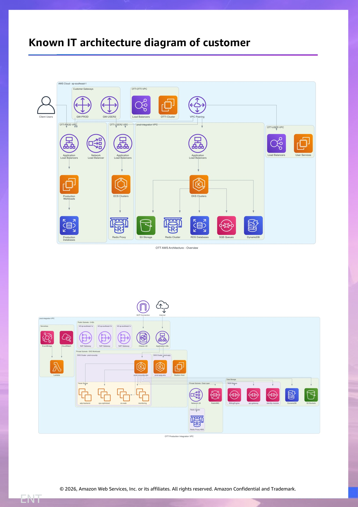
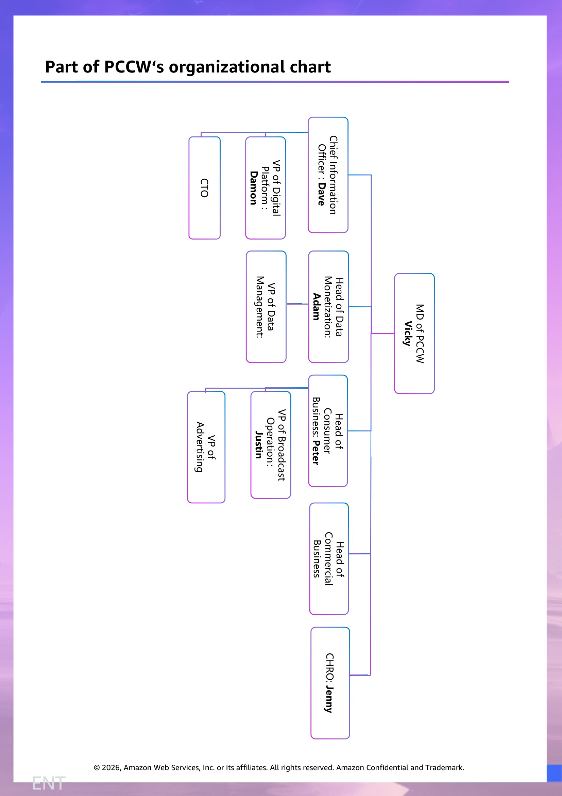

# 客户情报 - HKENT

> 此文档面向 Account Team & Manager,所有人可见。
> 内容来源:原 PPT 客户情报章节 (slide 1 至 Roleplay 起始页之前)。

## Customer Overview  (slide 2)

PCCW is a global company headquartered in Hong Kong which holds interests mainly in telecommunications, media, IT solutions. The company comprises multiple business segments, as shown in the figure below, including H Telecom, H Media, and H Solutions.

H Telecom is an integrated telecommunications operator providing fixed-line, broadband, mobile communication, and media entertainment services..

H Media is a fully integrated multimedia and entertainment BU which engaged in the provision of OTT （Over-The-Top） video service locally and in other regions and also operates a domestic free TV service in Hong Kong.

H Solutions is a leading IT and business process outsourcing provider in Hong Kong, mainland China and Southeast Asia.

PCCW employs over 20000 staff and maintains a presence in Hong Kong, Mainland China as well as other parts of the world.

PCCW‘s overall revenue growth was primarily driven by three business segments:  telecommunications continued to grow, OTT streaming business remained stable after strong growth in the prior year, and Free TV & Related Business achieved double-digit growth.

Main Business Segments

PCCW

H Telecom

H Media

H Solutions

Broadband

Fixed Line

Smart Living

Mobile Roaming

5G Solution

OTT Video Streaming Provider

Free TV

IT and business process outsourcing provider

## Customer’s Strategy（known）  (slide 3)

Leverage core telecom resilience: deliver high-quality mobile, broadband, and enterprise solutions; drive AI-powered digital transformation for personalization and upselling; support Hong Kong's Smart City initiatives through 5G, cloud, IoT, and enterprise projects.

Leverage stable telecom foundation while prudently scaling profitable media/OTT businesses

Expand OTT regionally (with strong growth in Southeast Asia), backed by high-quality local content, live events, and an entertainment ecosystem, positioning Hong Kong as a global cultural hub.

The Greater Bay Area strategy is PCCW‘s key mid-term play to escape Hong Kong’s saturated market, but success depends on differentiating through AI/5G capabilities for cross-border enterprise clients rather than competing directly with dominant mainland operators.

Drive profitability through cost discipline, AI adoption, and diversified revenue streams

Pursue digital transformation with AI integration across customer service and enterprise solutions

Expect to invest more in cloud service providers to enhance profitability and embrace AI technology.

Basic financial information

| Line Item (HK$ Millions) | FY2023 | FY2024 | FY2025 |
| --- | --- | --- | --- |
| Revenue | 25,443 | 26,290 | 28,176 |
| Total Operating Expenses | 21,775 | 22,118 | 24,009 |
| — Cost of Revenue (incl. D&A) | 18,185 | 18,619 | ~21,531 (est.) |
| — SG&A Expense (combined) | 3,585 | 3,859 | N/A |
| — Sales & Marketing | Not separately disclosed | Not separately disclosed | Not separately disclosed |
| — Technology & Development (R&D) | Not reported ($0) | Not reported ($0) | Not reported |
| — General & Administrative | Not separately disclosed | Not separately disclosed | Not separately disclosed |
| Operating Profit (EBIT) | 3,673 | 3,812 | 4,167 |
| Income Before Tax | 1,926 | 2,200 | 2,396 |
| Consolidated Net Income | 1,298 | 1,195 | 1,830 |
| Net Income (Loss) to Equity Holders | (330) | (210) | (177) |

## Customer's business challenges  (slide 4)

Hong Kong‘s telecom market is structurally saturated (mobile penetration 420%+, broadband ~100%), leaving virtually no room for subscriber growth (CAGR just 1.6-1.8%). PCCW must shift from customer acquisition to value enhancement — driving ARPU （Average Revenue Per User） through bundling, pivoting to high-margin enterprise AI/5G /IoT services, and expanding beyond Hong Kong via OTT video and the Greater Bay Area — or face revenue stagnation and margin erosion.

Economic uncertainty has resulted in a 15% reduction in enterprise customers‘ IT budgets, while aging demographics and tightening environmental regulations pose pressure on business models and data center operations.

Digital talent shortage is the core bottleneck across all of the PCCW‘s technology strategies. With Hong Kong facing a 50,000 ICT talent gap, the PCCW needs to rapidly upskill and recruit hundreds of cloud, AI, and cybersecurity specialists, yet its 20,000-strong workforce remains predominantly traditional telecom-skilled. Compounded by fierce competition, high costs, brain drain, and cultural friction between legacy telecom and innovation mindsets, the talent gap acts as a “multiplier” that amplifies every other strategic risk — any delay in talent readiness could mean missed transformation windows.

Potential risks faced by the customer

Cloud communications disruption, potentially leading to a 20-30% revenue decline in traditional telecom business.

Cloud communication platforms (UCaaS/CPaaS/CCaaS) like Microsoft Teams, Zoom, and Twilio pose the highest threat to PCCW (rated 4.35/5), potentially causing a 20-30% decline in PCCW‘s traditional telecom revenue as 50-70% of tech-oriented enterprises shift to cloud-based, API-driven models. With its current stack still hardware-centric, PCCW has prioritized an “ambidextrous model” transformation — investing HK$200M to build cloud communications capabilities and targeting 30% revenue contribution within 24 months, proactively self-disrupting while traditional cash flows remain intact.

Cybersecurity and data compliance risks exist

PCCW faces significant cybersecurity risks, with a security incident already occurring in Free TV's on-premises environment in 2024. Hong Kong’s new cybersecurity law (effective January 2026) Imposes strict incident reporting requirements and substantial penalties. Many core systems remain on-premises, while fragmented multi-cloud environments lack unified security governance — all while the company holds sensitive data of over 20 million users. Cybersecurity has been designated as the top strategic priority, but gaps in security architecture and capabilities remain.

> 演讲者备注:ARPU ： Average Revenue Per User

## Customer’s development & transformation opportunities  (slide 5)

Customer’s key competition

PCCW’s main competitor in the Hong Kong telecom market is China Mobile Hong Kong, which holds approximately 40% of the mobile communications market share with over 5 million customers, and through its acquisition of a 29.9% stake in Hong Kong Broadband, has formed a consortium that poses a direct threat to PCCW’s core business, intensifying competitive pressure in both fixed-line and mobile communications.

In the streaming and OTT business segment, PCCW‘s media platform faces competition from Netflix; although H Media has 16.8 million paid subscribers in Asia, slightly higher than Netflix's 14 million in Asia, Netflix's global brand influence and content resources still constitute   formidable competition.

Internet giants and cloud service providers (such as AWS, Alibaba Cloud, Tencent Cloud, etc.) are entering the communications market in a disruptive manner by offering cloud communication solutions like UCaaS and CPaaS, becoming the greatest substitute threat to PCCW‘s traditional business.

In the enterprise IT solutions space, PCCW also faces competition from international and local system integrators. Overall, PCCW confronts a multi-dimensional competitive landscape from traditional telecom operators, emerging cloud service providers, and internet platforms.

In smart city solutions, equipment vendors like Huawei and ZTE transform into solution providers, directly competing for government and major industry clients. PCCW must consolidate market position through technology innovation, service differentiation, and ecosystem building.

The Hong Kong government is committing significant resources to AI industrialization — including a HK$1 billion AI R&D Institute, a HK$10 billion I&T Fund, and an AI Supercomputing Centre — creating a strong tailwind for PCCW by expanding enterprise AI demand, driving high-speed connectivity needs, and helping alleviate ICT talent shortages through government-led training initiatives.

H Media‘s global expansion represents “growth with boundaries” — penetration in its core Southeast Asian market remains low, with the Middle East/Africa offering an emerging growth frontier, and differentiation through short dramas and the HBO Max partnership. However, constrained by a content budget far below Netflix‘s and high barriers in North America/Europe/China, H Media is unlikely to become a global platform. Its most realistic path is to deepen its presence in Southeast Asia and the Middle East/Africa, positioning itself as the leading distributor of Asian content in emerging markets — building competitive advantage regionally rather than globally

## Cloud providers already partnered with the customer  (slide 6)

Customer's cloud service usage

PCCW‘s IT vendor landscape is characterized by a fragmented “multi-cloud + on-premises” coexistence. AWS is one of the cloud providers, hosting core businesses including OTT,  and Pay TV App; GCP is mainly used for AI services (Gemini) and mobile data analytics; Huawei private cloud supports the Next-Gen Call Center (NGCC); while geopolitical pressures from US-China tensions are driving some business units toward adopting Alibaba Cloud and Huawei Cloud. Notably, critical systems such as PayTV Headend and Broadband remain almost entirely on-premises.

Overall, PCCW lacks a unified cloud strategy and security governance, with individual business lines independently selecting vendors, resulting in a complex landscape of five coexisting environments: AWS, GCP, Huawei, Alibaba Cloud, and on-premises.

| Business | Cloud/IT Vendors |
| --- | --- |
| OTT | AWS , GCP (backend) |
| Pay TV Headend | On-Premises |
| Pay TV App | AWS, On-Premises, GCP (Gemini) |
| Data Monetization | GCP (Data Analysis), AWS (EDW) |
| Internal Chatbot | AWS (Orchestration layer), Gemini + ChatGPT (LLM) |
| Next-Gen-Call-Center (NGCC) | Hua Wei (Private Cloud) |
| Broadband | On-Premises |

## Known IT architecture diagram of customer  (slide 7)

## Part of PCCW‘s organizational chart  (slide 8)

