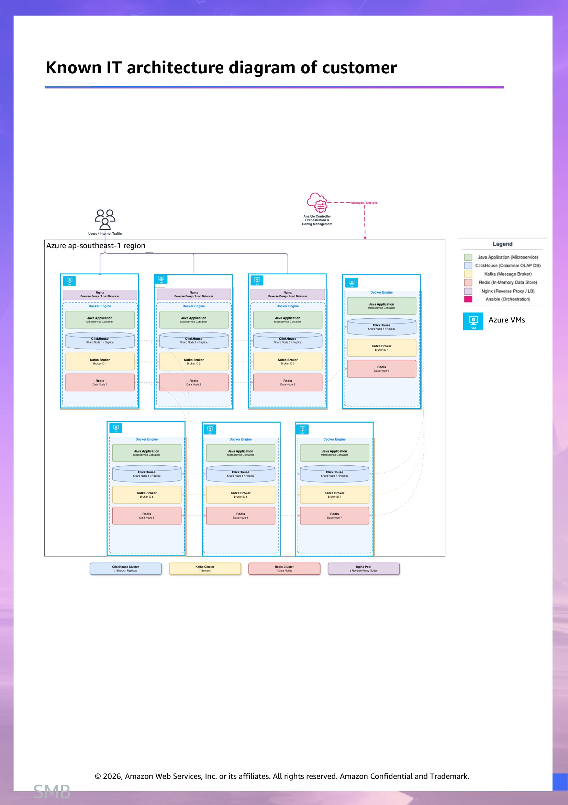
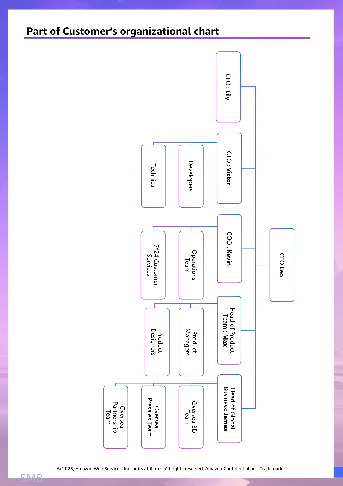

# 客户情报 - HKSMB

> 此文档面向 Account Team & Manager,所有人可见。
> 内容来源:原 PPT 客户情报章节 (slide 1 至 Roleplay 起始页之前)。

## Customer background information  (slide 2)

博睿 is a technology company headquartered in China, publicly listed on the Shenzhen Stock Exchange. With 19 years of development history, 博睿 has established itself as a pioneer in IT operations and observability solutions.

博睿 is committed to delivering advanced IT operations, maintenance monitoring, and observability solutions for enterprises. Their core product is the V ONE Portal - Unified Intelligent Observability Platform, which integrates big data and AI technologies to provide :

Full-stack, end-to-end observability — covering front-end web pages, mobile apps, networks, and back-end server applications

AI-powered anomaly prediction and root cause analysis — proactively alerts users and shortens Mean Time To Repair (MTTR)

Full chain data insights — enabling template-based unified observation of host resources, service availability, and abnormal events

High-performance architecture — capable of processing massive data volumes with speed and accuracy

With their strong background of Mainland China, they are planning to go global by leveraging Hong Kong as the intermediary and overseas gateway to reach global market.

Basic financial information

* Unit: USD in Thousands

| Financial Indicators | FY2022 | FY2023 | FY2024 |
| --- | --- | --- | --- |
| Revenue | 146,957 | 187,943 | 223,886 |
| Total Expense | 168,000 | 200,000 | 228,500 |
| — Cost of Revenue | 30,000 | 36,000 | 41,000 |
| — Sales & Marketing | 58,000 | 70,000 | 78,000 |
| — Technology & Development (R&D) | 48,000 | 57,000 | 65,000 |
| — General & Administrative | 32,000 | 37,000 | 44,500 |
| Operating Profit (Loss) | (21,043) | (12,057) | (4,614) |
| Income Before Tax | (22,000) | (13,200) | (5,800) |
| Net Income (Loss) | (19,500) | (11,500) | (4,700) |

## First half of 2025 Financial Report Analysis  (slide 3)

In the first half of 2025, 博睿 continued its loss-narrowing trajectory with notable progress in cost optimization and product mix improvement. Total revenue reached approximately $118,000K (up 5.3% YoY vs. H1 2024), reflecting a deliberate shift in revenue composition — while traditional proactive monitoring product revenue declined by approximately 18%, V ONE Portal product revenue grew by 92%, now accounting for over 60% of total revenue. On the expense side, the company executed disciplined cost control measures, reducing total operating expenses by 15%-20% YoY through headcount optimization, R&D project prioritization, and sales efficiency improvements, bringing the operating expense-to-revenue ratio down to approximately 98% (vs. 102% in FY2024). Net loss for H1 2025 narrowed to approximately $1,200K, putting the company on track toward breakeven by year-end.

The internationalization strategy was officially launched with the V ONE Portal Spring 2025 Edition (released in May), featuring four core upgrades: (1) Internationalization expansion with English version and Chinese-English switching, supporting both private deployment and SaaS dual-mode; (2) Cloud-native capability upgrade with deep Prometheus-on-K8S compatibility; (3) Full-stack observability deepening with optimized LLM model management, new event center, and automatic labeling; (4) User experience innovation with workbench and navigation redesign. The company is in a critical transformation phase of “controlling losses, enhancing product strength, and expanding overseas."

## Customer's business challenges  (slide 4)

Cloud-Native & AI Transition Pressure

The market is rapidly shifting toward cloud-native, AI-driven observability. 博睿 must continuously evolve its V ONE Portal platform to keep pace with: Increasing complexity of microservice architectures. Demand for full-stack, full-link tracing across distributed systems

AI-powered anomaly detection and root cause analysis capabilities

Price Competition & Commoditization

In China's tech market, there is strong pressure to compete on price. As the market matures, APM tools are becoming more commoditized, making it harder to justify premium pricing — especially against cloud-native monitoring tools bundled "for free" by major cloud providers for example AWS Cloud-CloudWatch, Alibaba Cloud - ARMS, Cloud monitor; Tencent Cloud - Cloud Monitor, Huawei Cloud - Application Operations Management ...etc. In contrast, a dedicated APMO platform like V ONE Portal provides cross-cloud, full-stack observability with AI-powered root cause analysis — capabilities that become critical as enterprises adopt multi-cloud and hybrid architectures.

Potential risks faced by the customer

Although 博睿 holds the #1 market share in China (though ranked outside the global top 15 in the industry ), it continues to operate at a loss and faces pressure from cloud providers employing price subsidy strategies to capture market share. Therefore, the company needs to achieve profitability through cost control and business model optimization.

The company must navigate increasingly stringent data security regulations, particularly the Data Security Law and cross-border data flow controls，while facing technical talent shortage risks, with widening gaps in core IT positions, intense competition for high-end talent, and rapidly rising salary costs.

博睿 has high customer concentration with significant impact from major customer losses. Financial customers often demand free POC for 3-6 months, while telecom operators typically use multi-round bidding to negotiate prices down by 30-50%. However, the high migration costs of APMO products create strong customer stickiness, which provides the company with certain protection.

## Customer’s development & transformation opportunities  (slide 5)

Customer’s key competition

While 博睿 holds the #1 market share in APM and observability market in Mainland China, it faces multifaceted competitive pressures. Domestic intelligent cloud technology presents significant competitive pressure in the localization market，with major cloud providers like AWS Cloud, Alibaba Cloud, Tencent Cloud, and Huawei Cloud building native observability tools bundled with their cloud platforms, while other local APM vendors compete aggressively on price. International giant Dynatrace exerts technological pressure through AI-driven automation capabilities and open-source solutions such as Prometheus+Grafana present significant alternative threats.

The global APM/Observability market is experiencing robust growth. Currently valued at $9-13 billion in 2025 depending on market scope definitions, the market is projected to expand significantly to $25-47 billion by 2030-2034, with compound annual growth rates ranging from 11% to 30%+ across various analyst forecasts.

As technology evolves, user experience excellence has become a trend, with nearly half of enterprises prioritizing end-user satisfaction as their most important metric. The company‘s digital experience monitoring products are seeing increased demand.

Green IT has emerged as a new market trend, with the latest data showing 45% of enterprises listing environmental factors as an important consideration in IT procurement. The company can develop carbon emission monitoring modules and green data center management features to create differentiated competitive advantages.

博睿 is executing a dual-engine strategy: on one hand, deepening the integration of AI technology and observability, with plans to launch AI Agent billing and AI system observability billing modules in 2026; on the other hand, accelerating international expansion through Hong Kong and Singapore subsidiaries to tap overseas markets. 博睿 hopes to leverage Hong Kong as a strategic intermediary and overseas gateway to expand into emerging markets in Southeast Asia and Central Asia, while developing a SaaS model targeting global SMB customers and accelerating international growth through International Cloud provider as a key channel.

## Cloud providers already partnered with the customer  (slide 6)

Customer's cloud service usage

Company holds a 19.8% market share in the domestic APMO (Application Performance Monitoring and Observability) market with a clear leading advantage. By deepening cooperation with major tech companies such as Huawei Cloud and ByteDance, the company can build ecosystem barriers. Under the trend of domestic substitution, the company‘s deep adaptation capabilities in government and financial sectors constitute differentiated competitive advantages.

博睿‘s collaboration with Huawei adopts a dual-track business model. In January 2024, 博睿 became a co-operating partner of Huawei Cloud’s cloud marketplace in the IT monitoring and observability domain, operating under its independent brand through a co-operation model, jointly building an integrated intelligent observability service experience. In June of the same year, 博睿 signed a UCS observability software framework procurement agreement with Huawei Cloud Computing Technology Co., Ltd., formally becoming a Huawei Cloud supplier with its products being OEM’d into Huawei Cloud‘s product ecosystem，and has been adapted to Huawei's Kunpeng series processors.

博睿 has launched a product-level ecosystem collaboration with ByteDance‘s Volcano Engine since 2021, with both parties focusing on the application performance monitoring domain and jointly committed to enhancing observability in cloud-native environments, building a comprehensive cloud-native monitoring management system from dimensions such as Trace (call chain), Metric (metrics), and Log (logs).

|  | IT Vendors |  |
| --- | --- | --- |
| SaaS Platform  (in Mainland China) | Tencent ,HuaWei |  |
| Internal application | On Premises |  |
| SaaS Platform (Oversea) | Azure ap-southeast-1 region |  |

## Known IT architecture diagram of customer  (slide 7)

## Part of Customer‘s organizational chart  (slide 8)

