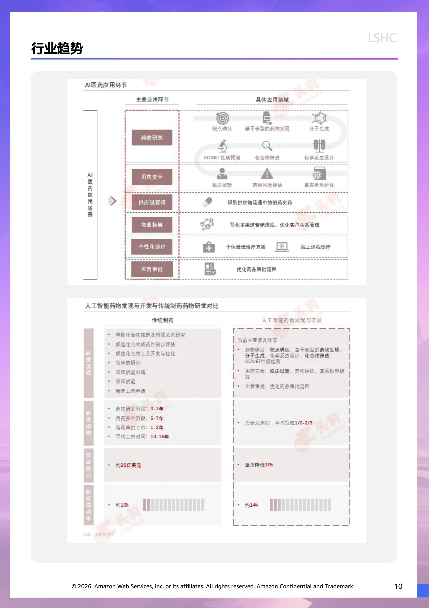
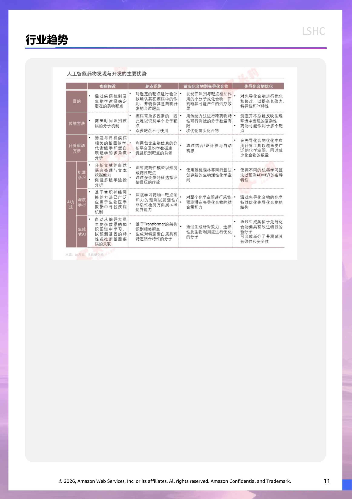
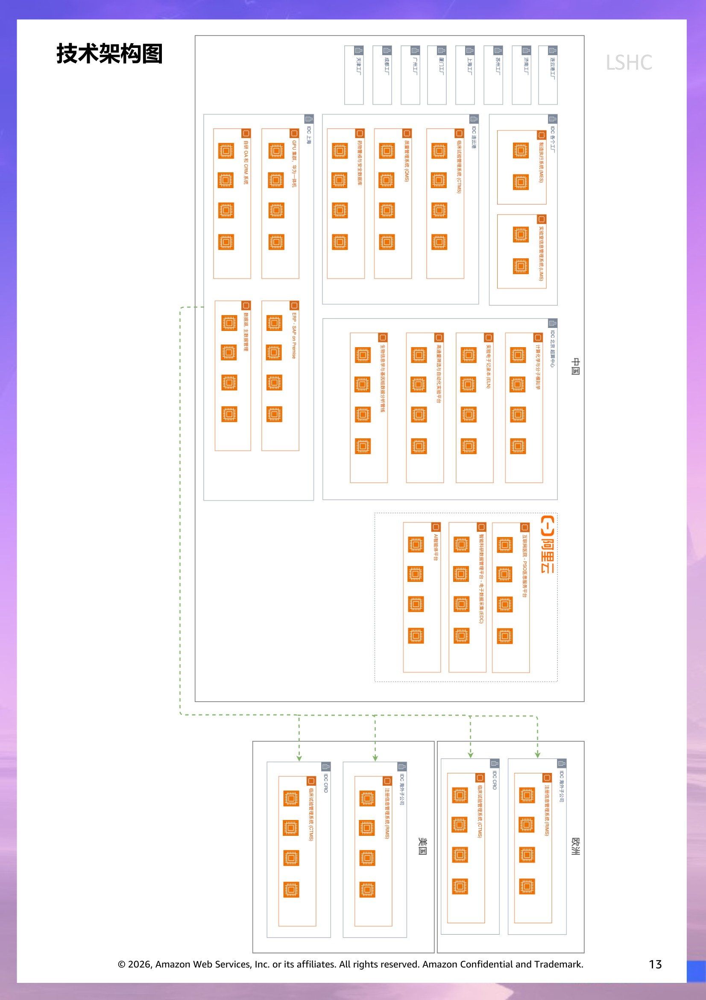
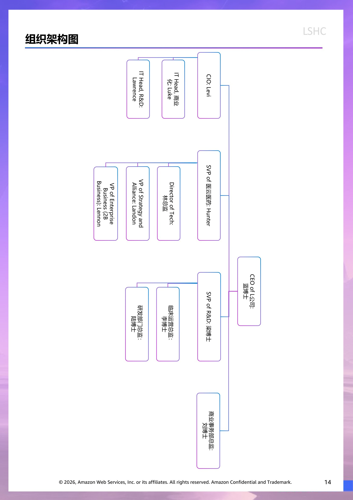

# 客户情报 - LSHC

> 此文档面向 Account Team & Manager,所有人可见。
> 内容来源:原 PPT 客户情报章节 (slide 1 至 Roleplay 起始页之前)。

## 客户背景信息  (slide 2)

恒瑞医药创立于1996年，是一家专注研发、生产及推广高品质药物的创新型国际化制药企业，聚焦肿瘤、代谢和心血管疾病、免疫和呼吸系统疾病以及神经科学等领域进行新药研发，是国内最具创新能力的制药龙头企业之一。

二十余年来， L公司始终坚持为患者服务的初心，努力守护患者健康生活和生命质量，攻坚克难推进医药产业高质量发展。在美国制药经理人杂志公布的全球制药企业TOP50榜单中， L公司已连续6年上榜；国际知名咨询机构Citeline发布的全球TOP25管线规模制药公司榜单，恒瑞医药连续3年上榜，2025年自研管线数量位居全球第三；中国医药工业信息中心历年发布的“中国医药研发产品线最佳工业企业”，恒瑞医药已11次登顶榜首。

用创新守护生命健康——L公司始终把科技创新作为第一发展战略，持续加大创新力度，累计研发投入已达460亿元，位居全国医药行业前列。公司在中国、日本、美国、澳大利亚及瑞士设立了14个研发中心，全球研发团队超5500人。目前已在国内获批上市23款新分子实体药物（1类创新药）和4款其他创新药（2类新药），有90多个自主创新产品正在临床开发，约400项临床试验在国内外开展。公司还建立了PROTAC、肽类、单克隆抗体、双特异性抗体、多特异性抗体、ADC及放射性配体疗法等一批国际领先的技术平台，为创新研发提供强大基础保障。

让新药、好药惠及更多患者——作为国内医药研发龙头企业，恒瑞医药切实履行企业社会责任，持续提升优质药物的可及性。公司积极支持国家医保惠民举措，已有106个产品陆续进入国家医保目录，其中包括卡瑞利珠单抗、瑞维鲁胺等15款创新药，让国内患者“用得上、用得起”新药、好药。我国首个获批小细胞肺癌适应症的自主研发PD-L1抑制剂阿得贝利单抗上市后不久便被北京、上海等多地纳入“惠民保”，切实减轻患者经济负担。

努力推动中国制药品牌走向世界——稳步推进国际化，是恒瑞医药的长期发展战略。目前，公司的医药产品已进入超过40个国家，还在继续加快开拓全球市场并关注新兴市场。公司积极向海外输出创新成果，将LRS-1234、LRS-12345等多个具有自主知识产权的创新药对海外授权，其中与德国达姆施塔特默克集团的全资子公司达成的授权合作，交易总额可能高达14亿欧元；GLP-1类创新药LRS-1236、LRS-12347、LRS-1238总交易额约60亿美元并取得19.9%的股权；与默沙东达成的授权合作，交易总额可达19.7亿美元。此外，公司已在欧美日获得包括注射剂、口服制剂和吸入性麻醉剂在内的20余个注册批件，提高了全球不同地区患者的药物可及性。

恒瑞医药将始终坚持“科技为本，为人类创造健康生活”的使命，以“专注创新，打造跨国制药集团”为愿景，不断强化技术创新主体地位，力争研制出更多的新药、好药，服务“健康中国”，惠及全球患者。

## 经营模式  (slide 3)

研发

公司坚定不移地以创新为动力，坚持差异化研发策略，以临床需求为导向，历经二十多年在新药研发领域深耕，不断优化已有研发管理体系，公司通过涵盖早研、CMC、临床前开发、转化医学、注册、临床团队的全新电子化研发项目管理平台，覆盖药物靶点发现、分子筛选、临床产品开发、注册以及真实世界数据呈现的研发全周期全场景智能化运筹管理，建立统一、标准化的项目管理数字化信息平台，实行项目全流程管理。

以下为研发项目关键步骤的概述：

靶点识别和验证: 在最早阶段，公司通过深入研究疾病的发病机理和靶点的作用机制，并关注国际会议上发表的最新研究成果，探索公司认为可能为同类首创或同类最佳的靶点。公司还可能应用先进技术来简化药物发现、分子设计、药物性质预测和优化工作。分子发现和修饰。选定靶点后，公司在技术平台上对化合物进行测试和筛选，以选出苗头化合物－对药物靶点显示出理想的生物活性并在再次测试时再现这种活性的化合物；先导化合物－在确定的化学系列中对特定治疗靶点显示出强大的药理和生物活性的化合物；以及最终的临床前候选化合物。

临床前研究: 在确定临床候选化合物后，公司会对其进行临床前研究。相关研究包括药效学研究、药代动力学研究、药理毒理研究以及CMC研究。IND(新药研究)申请。在临床前候选化合物经过充分、全面的临床前验证并达到预定的疗效和安全性指标后，公司将向适用的监管机构（如国家药监局）提交IND 申请。临床试验。一旦获得IND批准，公司将通过有资质的医疗机构开展临床试验。公司的职责包括设计临床方案、确保临床试验的资金以及监督和管理试验，以确保数据质量和程序合规，并遵守 GCP (药物临床试验质量管理规范) 标准。公司还在整个试验过程中监控研究产品的安全性和有效性，确保符合所有监管规定。

新药上市申请(NDA/BLA): 在成功完成临床试验并收集到足够的数据以证明药物的安全性和有效性后，公司会向适用的监管机构（如国家药监局）提交 NDA或BLA。提交的材料包括临床前研究、临床试验以及CMC的综合数据材料。之后，监管机构通常会对申请材料进行全面审查，其中可能包括对临床试验场所和生产设施进行现场检查，以验证数据的完整性以及是否符合适用的GMP 要求。

## 经营模式  (slide 4)

生产

为进一步提高生产系统竞争力，公司不断提升生产运营效率，加强智能化建设，持续完善并严格执行生产管理制度及流程。公司持续完善研、销、产、采多方沟通协调机制，提升供应链上下游协同效率，加强供应保障能力。建立科学的计划管理体系，以研发和市场预期为导向，评估产线产能并合理规划。根据需求变化，结合产线能力、物料及产品库存情况实时调整供应方案，提高响应速度，确保供应的及时性和高效性。

公司从认可的供应商采购原材料，从多方面制定了供应商准入政策、绩效政策及在制品供应商管理政策，并已建立涵盖原辅包等物料接收、检验、评估、放行及分发等各个环节的全面质量管理政策，采用数字化供应商关系管理系统，对原材料采购的全生命周期进行管理。公司通过充分的生产过程质量管理体系，对中间产品、半成品进行质量检测，确保生产过程符合 GMP 要求。公司实施了完整的最终产品放行测试、审批和放行政策，所有最终产品在投放市场之前，都必须经过抽样和放行测试，严格按照适用的国家药品质量标准和检测方法进行检测，结果符合 GMP 要求并达到相关质量标准的最终产品将被放行。在货物储存管理中，公司建立存货管理系统监控仓储发运各个阶段，并根据适用的 GMP 要求规范存货的接收、储存、分发及运输，积极使用 ERP 及WMS 系统对存货进行数字化管理并记录仓储人员运作，提高存货管理效率。同时，公司还建立了完善的药物警戒系统，制定了包括投诉处理政策、药品不良反应监测政策和产品召回政策等在内的一系列政策措施，实现产品上市后的有效质量管理。

销售

公司秉持“以市场为导向，以患者为中心”的理念，不断提升销售体系运营效率，促进资源整合，顺应新形势、新变化，促进全面合规，推动公司健康持续发展。公司目前形成了策略规划、中央市场营销、中央医学事务、中央及省级销售管理、中央及省级市场准入等互补职能以支持专业销售队伍。策略规划职能主要包括制定商业策略，进行市场调研和分析，与生产及研发团队相配合，以支持销售及营销活动，并使研发及生产决策更好地匹配市场需求。中央市场营销职能主要包括深入分析产品治疗领域、患者治疗过程及临床优势，制定差异化品牌战略，向各类医疗健康专业人士有效传达产品优势。中央医学事务职能主要包括制定医疗策略，从医生的临床实践中收集观点，审查及支持研究人员发起的试验，并就创新产品进行真实世界研究及医学教育培训。中央及省级销售管理职能主要包括管理及提升销售活动效率，实施销售策略及管理扩展本土市场销售网络。中央及省级市场准入职能主要包括与监管机构就市场准入相关事宜进行磋商，并致力于推动药品入院。

下页继续…

## 经营模式  (slide 5)

销售

公司专注于以学术推广的形式推动市场加速使用前沿创新成果。早在药物发现过程中，公司就会对候选分子的商业潜力进行评估，以有效识别有前景的化合物。一旦获得良好的临床结果，便会通过学术推广的方式，为有关在研产品的商业化做准备。凭借 50多年的行业经验和优质品牌，公司与许多知名医生和其他医疗健康机构建立了长期的学术关系。公司支持研究人员发起的试验，并开展产品上市后的真实世界研究，以惠及更多患者，并收集临床证据从而进一步验证产品。公司研发成果在各类顶级学术期刊上发表，有助于提高人们对公司差异化创新药的认识及提升其在医学界的接受度。此外，根据品牌策略，公司还积极组织及参与医学研究资助计划，以促进医学界的发展。

公司在国内主要通过向分销商销售产品来获得药品销售收入，分销商再将公司的产品销售给

医院、其他医疗机构及药店。这种分销模式有助于公司以具有成本效益的方式扩大覆盖范围，同

时能够对分销网络和营销推广过程保持适当控制。公司、分销商以及自分销商购买公司产品的医

院、其他医疗机构及药店之间的关系如下图所示：

公司主要根据分销商的业务资质、信誉、分销覆盖范围、销售能力、过往表现、声誉及合规

记录等标准筛选分销商。公司进行检查以评估分销商的表现，并检查分销商的资质，以确保他们

已就相关产品的分销取得必要的许可证、牌照及认证。公司定期评估分销商以确定是否调整合资

格分销商名单及其指定分销区域。同时，公司积极监控分销商数目及存货水平，并进一步追踪产

品流向，以不断优化产品交付过程及市场覆盖率。此外，公司还在不断开拓全球市场并重点关注

新兴市场，与当地有实力的医药公司合作，提供高质量且有价格竞争力的药品。

## 业务挑战  (slide 6)

恒瑞医药目前面临的核心挑战主要源自三个方面：政策与市场环境压力、创新药竞争格局以及国际化发展瓶颈。

政策与市场环境压力

集中采购政策对仿制药盈利能力造成显著冲击，恒瑞医药28个纳入集采的品种平均降价73%，核心产品降幅更达85%，导致2024-2025年营收与净利润同步下滑。同时，医保谈判进一步压缩了利润空间，创新药纳入医保后价格大幅下调，销量增长难以抵消降价影响。此外，恒瑞医药过往重点布局的治疗领域竞争日趋激烈，如JD-1抑制剂、LLP-1激动剂等，国内已有14款同类产品参与竞争。另外，恒瑞医药起家的仿制药业务持续拖累公司转型进程，2024年仿制药仍占总营收超50%，其显著下滑严重影响了公司整体增长表现。

创新药竞争格局

公司历史管线布局多集中于竞争激烈的红海市场，国内创新药靶点高度集中，me-too类产品扎堆，缺乏具有突破性的first-in-class产品。恒瑞医药缺少差异化的重磅产品。作为国内医药行业领军企业，恒瑞医药在2024年开始落后于竞争对手，2024年创新药收入达138.92亿元，仅为百济神州（272.14亿元）的一半。百济神州凭借泽布替尼（年销售额超18亿美元）成为"十亿美元分子"的标杆企业，而恒瑞医药尚无同等级别产品（无论从first-in-class创新性还是全球化布局角度而言）。

国际化发展瓶颈

在寻求业务新增长点方面，除了开发具有竞争力的新产品外，恒瑞医药还致力于拓展市场，但目前仍面临国际化瓶颈。从实际业务表现看，恒瑞医药海外收入占比不足5%，远低于百济神州超过50%的海外收入占比。公司此前尝试的自主出海战略遭遇挫折，例如核心产品卡里利珠双抗和阿帕奇尼在美国审批受阻，以及早期对外授权交易未能充分获益，如2023年SLR-1945以较低价格授权给美国公司，后者被葛兰素史克高价收购，恒瑞医药未能从中充分受益。

目前恒瑞医药在资本市场表现承压，2025年百济神州市值首次超越恒瑞医药，终结了恒瑞医药15年的"医药一哥"地位。公司研发投入较高，占营收的22.5%，导致短期盈利能力面临压力。

## 客户财务基本情况  (slide 7)

研发投入

|  | 2022 | 2023 | 2024 |
| --- | --- | --- | --- |
| 营业总收入 | 21,275 | 22,819 | 27,984 |
| 营业总成本 | 17,747 | 18,214 | 21,008 |
| 销售费用 | 7,347 | 7,577 | 8,336 |
| 管理费用 | 2,306 | 2,416 | 2,555 |
| 研发费用 | 4,886 | 4,953 | 6,582 |
| 财务费用 | -470 | -478 | -572 |
| 其他 | 3,405 | 3,746 | 4,107 |
| 营业利润 | 4,111 | 4,909 | 7,490 |
| 净利润 | 3,815 | 4,277 | 6,337 |
| 综合收益总额 | 3,831 | 4,295 | 6,336 |
|  |  |  |  |
|  | *单位：人民币百万元 |  |  |

## 客户现有战略方向  (slide 8)

恒瑞医药正在通过四大战略方向推动公司转型升级：研发转型与管线升级、国际化战略创新以及资本运作与组织变革。

研发转型与管线升级

恒瑞医药正积极调整研发策略，从低竞争力的me-too产品转向首创新药和同类最优管线开发：

高价值领域布局：重点发力ADC药物和多肽领域等前沿技术平台

扩大现有产品价值：针对已上市产品拓展新适应症，探索"免疫+靶向"联合疗法提升临床疗效

前沿技术布局：建设mRNA生产线，战略性进入核药等新兴赛道

国际化战略创新

恒瑞医药正从传统单一授权模式向多元化国际化战略转型：

创新"借船出海"模式：从传统license-out升级到New-Co模式，与资本合作成立海外公司，保留股权和分阶段收益权，实现风险共担与长期价值获取

加速海外临床与上市进程：招募海外临床专业团队，通过CRO执行国际多中心临床试验，已推动4款ADC产品获得FDA快速通道资格

构建全球化运营体系：系统性布局海外研发、注册和商业化能力

资本运作与组织变革

恒瑞医药通过多维度变革增强企业韧性和长期竞争力：

多元化融资：2025年5月港股上市，拟募资145亿港元（公司25年来首次股权融资），为长期发展提供资金支持

组织精简与效能提升：销售团队从2020年的1.7万人精简至2024年的8,910人，降幅达48%，同时推动专业化医学推广模式

高端人才引进：聘请江宁均（前赛诺菲亚太研发总裁）主导业务发展，组建国际化管理团队（如北美强生背景高管）提升全球化运营能力

生态系统布局

恒瑞医药在强化核心制药业务的同时，积极布局上下游产业链：

原料药业务：持续发展原料药生产及出口，保持成本优势

医疗科技拓展：布局云医院领域作为新利润增长点，同时支持集团内数字化转型需求

多元化医疗器械业务：拓展医疗器械领域，实现业务协同

通过这些系统性战略调整，恒瑞医药正努力应对当前挑战，重塑核心竞争优势，推动企业向更高质量、更具全球竞争力的创新型制药企业转型。

## 行业趋势  (slide 9)

日前，NVIDIA宣布与IQVIA、Illumina、妙佑医疗国际、Arc研究所等多个医疗健康领域的领先机构合作，旨在通过AI和加速计算技术推动药物发现、基因组研究和医疗服务的创新。这些合作的核心在于利用AI技术加速药物研发流程，提高临床试验效率，减少行政负担，同时推动数字病理学和精准医学的应用。AI技术，尤其是生成式AI和智能体，正在成为制药行业的重要工具。通过深度学习和数据分析，AI能够从大量的生物数据中发现潜在的药物靶点，加快药物研发进程。此外，AI还在临床试验设计和患者监测方面发挥着关键作用，帮助制药公司提高试验成功率、优化资源配置，并推动个性化治疗方案的实施。

根据中国医药创新促进会研究，在药物研发阶段，传统的药物靶点识别、药物筛选、分子合成等方式周期长、成本高，因此AI在药物研发领域的应用最为广泛。AI可对大量现有的药物数据进行深度学习，以此分析药物的化学性质和生物活性，更快地设计新药物，预测药物的吸收、代谢和毒性等复杂过程，从而缩短药物研发时间。相较于传统药物研发，AI技术能将药物发现、临床前研究的时间缩短近40%，临床新药研发成功率可从12%提高到约14%。在药品生产领域，通过AI模型的分析和挖掘，企业可以提升药品生产过程检测的效率。在药品营销领域，AI已具备快速分析目标市场和患者画像的能力，可提供药品个性化的营销与药品推荐。

传统的药物研发具有研发周期长、资金投入大、研发失败风险高的特点，药物发现和临床试验中累计研发成本投入持续增加，成功率却基本维持在10%，导致研发风险不断攀升，药物研发的转型升级需求显著提高。

人工智能药物发现与开发通过应用机器学习、深度学习、大数据和自然语言处理等技术，对化合物的结构、药物作用机制、基因等海量数据进行结构化分析处理，快速精准地确定靶点、筛选最佳化合物分子、预测药代动力学性质。人工智能药物发现与开发可大幅缩短药物研发各环节所需周期、降低企业在研发新药时的成本投入，同时提高药物研发的成功率、降低新药研发风险，提升企业的投资回报率，相较于传统制药在新药研发领域拥有绝对优势。

去几年，中国人工智能药物发现与开发市场规模快速增长的原因有：

(1)政策鼓励人工智能等新一代信息技术赋能医药研发。“十四五”医药工业发展规划指出要“坚持创新引领”，与“十三五”规划提到的“坚持创新驱动”对比，是对医药工业创新研发的进一步转型要求，实质是从“Me-too”、“Fast Follow”向“First-in-class”的转变，通过鼓励创新研发投入、AI技术赋能，调动制药创新的积极性，推动人工智能药物发现与开发行业快速发展。

(2)AI技术的迭代推动人工智能药物发现与开发行业的发展。AI技术是人工智能药物发现与开发行业发展的根本，20世纪80年代，默沙东运用计算机辅助进行药物设计，后伴随着谷歌DeepMind研发的AlphaGo、AlphaZero、AlphaFold1和AlphaFold2的相继问世，又从蛋白质空间预测上为大分子药物研发提供了优化思路。近年来AI技术的不断突破助力人工智能药物发现与开发行业的快速发展。

## 行业趋势  (slide 10)

## 行业趋势  (slide 11)

## 客户的现有 IT 供应商情况  (slide 12)

|  | 供应商 |  |
| --- | --- | --- |
| 制造执行系统 (MES) | IDC |  |
| 实验室信息管理系统 (LIMS) | IDC |  |
| 临床试验管理系统 (CTMS) | IDC |  |
| 质量管理系统 (QMS) | IDC |  |
| 药物警戒与安全数据库 | IDC |  |
| 注册信息管理系统 (RIMS) | IDC |  |
| 计算化学分子模拟 | IDC |  |
| 实验电子记录本 (ELN) | IDC |  |
| 高通量筛选与自动化实验平台 | IDC |  |
| 生物信息与多组学数据分析管线 | IDC |  |
| GPU 集群 / 算力一体机 | IDC |  |
| OA & CRM 系统 | IDC |  |
| ERP (SAP on Premise) | IDC |  |
| 数据湖与主数据管理 | IDC |  |
| 互联网医院‑PSO 医患服务平台 | 阿里云 |  |
| 智能试验数据管理平台 / 电子数据采集 (EDC) | 阿里云 |  |
| AI 管理平台 | 阿里云 |  |

## 技术架构图  (slide 13)

> 演讲者备注:目前不清楚内部的自建云架构不清楚

## 组织架构图  (slide 14)

