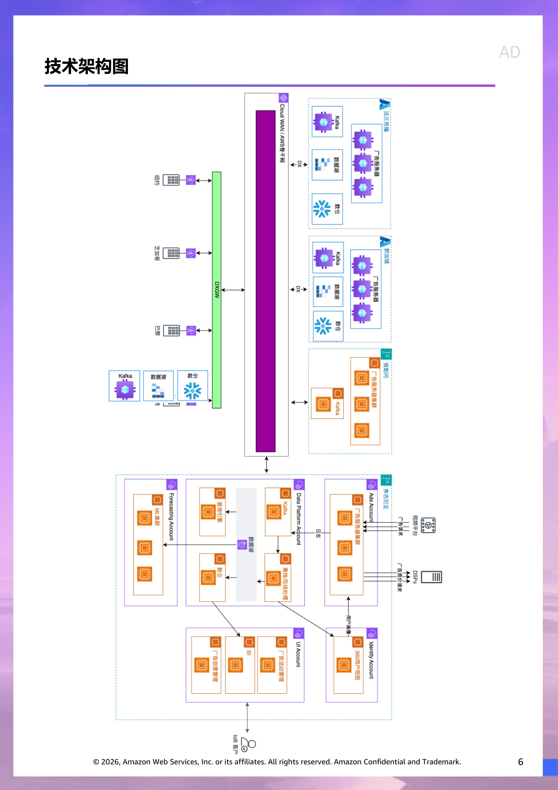
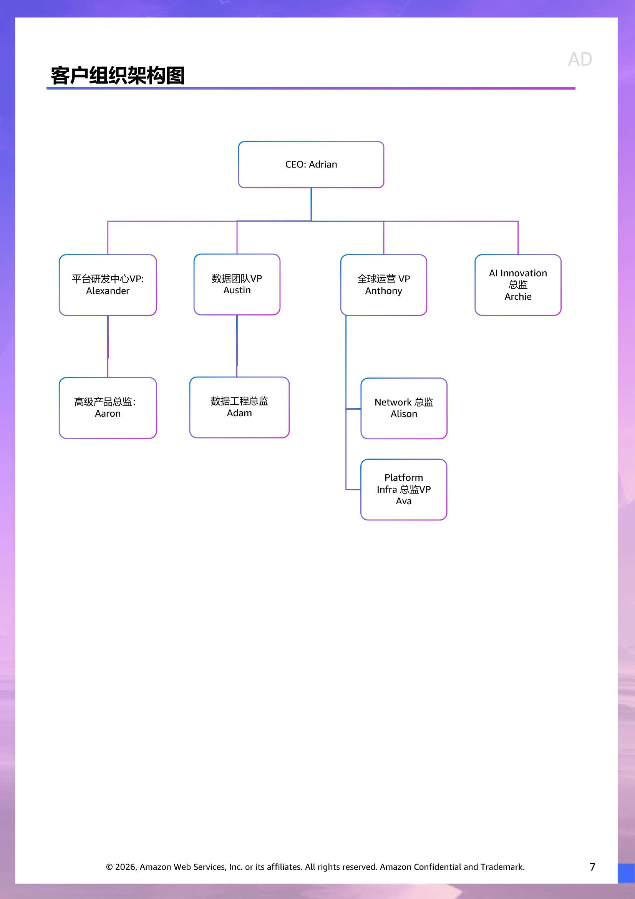

# 客户情报 - ME

> 此文档面向 Account Team & Manager,所有人可见。
> 内容来源:原 PPT 客户情报章节 (slide 1 至 Roleplay 起始页之前)。

## 客户背景信息  (slide 2)

在广告技术行业，Freewheel主要业务是电视网络和主要视频分销商，作为该领域最大的平台之一，为客户提供在线广告和内容。作为一家专注于电视和数字视频广告技术解决方案的领先公司，Freewheel致力于为媒体公司、广告主和发布商提供跨平台的广告管理、投放优化及收益最大化服务。自 2005 年成立以来，该公司的客户包括福克斯、NBC环球、天空、特纳和哥伦比亚广播公司等。

2022年，被美国媒体巨头AD集团收购，总部和核心管理团队/高层位于美国纽约，其研发中心位于上海，并在欧洲和印度扩大运营团队。利用AD集团的生态优势， Freewheel深度绑定欧美主流电视媒体资源，同时在亚太市场扩展业务。现在其平台对接超过45%的欧美电视广告流量，擅长处理复杂的大规模广告交易。同时，也利用其平台 Marketplace 的优势，为长尾客户提供广告的投放和管理。

作为AD集团旗下企业， Freewheel通过其先进的广告技术平台整合线性电视、流媒体及数字视频的广告资源，帮助客户实现精准定向、程序化交易和数据分析，以提升广告效果与运营效率，尤其在大屏生态和高端视频领域占据重要地位。其解决方案覆盖广告端到端全生命周期，助力行业伙伴在复杂多变的媒体环境中实现商业价值增长。

Live Event 是Freewheel创收和运营的重要组成部分，成功交付了全球主要体育和政治广播，包括多届奥运会、世界杯锦标赛、美国总统选举等等。

财务基本情况

|  | 2022 | 2023 | 2024 |
| --- | --- | --- | --- |
| Revenue | 577,069 | 619,710 | 668,170 |
| Total Expense | 689,853 | 774,719 | 617,083 |
| Cost of revenue | 307,165 | 409,906 | 258,838 |
| Sales and marketing | 200,081 | 173,982 | 166,142 |
| Technology and development | 93,757 | 94,318 | 95,243 |
| General and administrative | 81,382 | 89,048 | 96,860 |
| Merger, Acquisition | 7,468 | 7,465 |  |
| Operating Profit | (112,784) | (155,009) | 51,087 |
| Income before tax | (135,597) | (157,547) | 26,484 |
| Net Income | (139,323) | (159,184) | 22,786 |
|  |  |  |  |
|  | *单位：美金千元 |  |  |

## 2024收入分析  (slide 3)

截至2024年12月31日的年度，收入较上一年增长了4850万美元，即8%。 A公司的收入增长主要由CTV (Connected TV) 和移动端推动。来自CTV、移动端和桌面端的收入分别增长了3530万美元（13%）、1210万美元（5%）和100万美元（1%）。

Freewheel的收入主要取决于广告交易的数量和库存售价，这些因素决定了平台上的总广告支出。按净额报告的收入而言， A公司对服务收取的抽成比例。由于定价和抽成比例因出版商、渠道和交易类型而异， A公司的收入会受到出版商特定抽成比例变化的影响，以及平台上出版商和交易类型之间广告支出组合的变化。

对于2025年，Freewheel相信收入将较上一年期间增加，并且预计CTV将继续成为最大的增长驱动力。

截至2024年12月31日的年度，营业成本较上一年减少了1.511亿美元，即37%，主要是由于进行了重大的组织变革，裁员，及业务整合。云用量、数据中心和带宽费用增加1180万美元，这主要是由于收入增长和平台上处理的交易量相应增加。

业务挑战

近三年欧美经济下行压力（如高通胀、消费疲软）导致部分广告主/品牌方预算收缩，影响广告技术公司短期增速，尤其影响高价的长视频广告（Freewheel的核心领域）。

广告技术行业毛利率较高，但Freewheel持续投入研发（如AI驱动的广告优化）及近年对相关业务收购，对短期利润产生压力。此外，程序化广告市场透明化导致广告技术费率（Take Rate）下降， Freewheel需通过技术升级维持盈利空间。尽管流量成本优化工作取得了成功，但成本增长和收入增长之间的差距仍然令人担忧，2023 年Freewheel收入目标没有达成预期，促使AD集团对Freewheel进行了重大的组织变革。

流媒体平台倾向于自建广告系统，如 Netflix、Disney+等头部平台推出自有广告技术栈（如 Disney 的 “Disney Real-Time Ad Exchange”），可能绕过Freewheel等第三方服务商，直接与广告主合作，挤压其市场份额。传统电视广告收入持续下滑（2023 年美国下降4.5%），广告主倾向效果广告（如社交媒体、搜索广告），品牌广告预算向短视频（TikTok）和零售媒体（Amazon Ads）分流，威胁大屏广告的预算占比。欧洲广告生态分散， Freewheel需适应不同国家的监管和媒体习惯；亚洲市场（如中国）存在本土强敌（如阿里、腾讯广告）。其母公司A的集团在美国市场资源倾斜明显，可能限制其在亚太等新兴市场的投入力度。

## 潜在风险  (slide 4)

从地缘政治角度，随着这几年中美紧张局势的加剧，加上美国14117号总统令要求加强数据隐私监管的内容，Freewheel在安全和治理方面面临着巨大压力。特别是自2023年中期以来，上海Freewheel的员工被禁止访问他们的一些内部系统。基于这一背景， A公司决定从2024年年中开始执行从上海到纽约3年100人转移计划，公司的运营重心逐渐向纽约办公室倾斜。此外，他们已于2023年10月开始在印度招聘员工。员工离职时，上海的员工HC不会被填补。尽管中国上海研发中心目前继续运营，但没有看到上海办事处有任何新的招聘计划。自2024年4月以来，由于成本压力大， A公司已经解雇了100多名员工。

目前 Freewheel收入高度依赖 AD集团旗下媒体资源，若母公司流媒体业务增长放缓（如AD集团流媒体平台Peafowl用户增速不及预期），将直接影响其业绩。母公司AD集团的传统广电基因同样可能会拖累 Freewheel在敏捷创新上的效率。

发展及转型机会

全球流媒体用户增长持续为Freewheel带来结构性机会。其技术平台可进一步优化其广告的动态插播（如剧集暂停广告）、互动广告等创新形式，提升广告投放效率。

进一步整合母公司 AD集团内部资源及优势，深度绑定同集团兄弟公司同时也是客户的 ABContinental内容库（如电影IP广告植入）、流媒体平台 Peafowl 的用户数据，构建“内容+广告+数据”闭环。利用 AD集团的宽带与机顶盒数据，强化家庭级定向能力（如识别高收入社区用户偏好），进行高净值广告投放。

新兴技术变革：通过机器学习优化广告投放策略，例如预测高价值用户观看时段、动态调整竞价策略，提升广告主ROI。生成式AI 或许将帮助 Freewheel从“广告投放平台”升级为“智能广告生态平台”。通过生成式 AI 技术，优化广告精准投放效率、动态优化能力及进行用户体验重塑。

新兴市场拓展：依托同集团兄弟公司Moon的渠道资源，扩展南美广告网络，适配本地化内容（如足球赛事直播广告）。突破如亚太等新兴市场，与本地流媒体平台合作，提供定制化广告管理系统。探索中国市场的“出海品牌”需求，帮助国际客户在TikTok、B站等平台以外补充大屏广告覆盖。

Freewheel期望通过整合自身的核心广告平台、通过收购 DSP 公司 、SSP 公司 、Agency 公司，与其服务长尾客户的 Marketplace，打造完善技术生态、强化全渠道程序化能力并打通广告服务的全链路。

## IT供应商简况  (slide 5)

主要竞争对手

主要竞争对手举例：Google Ads Manager（提供广告管理和交付服务，覆盖广泛的数字广告市场）、Adnite（提供涵盖各种形式广告的程序化广告交易平台）和 Publicate（提供数字广告自动化解决方案，专注于程序化广告）是Freewheel的主要竞争对手，特别是在程序化广告和视频广告领域。

Freewheel的核心优势在于其“传统电视广告基因+顶级媒体资源+跨屏技术”，特别适合需要整合电视和数字广告的大型媒体集团和高端品牌。相比之下，竞争对手更专注于纯数字广告的某个方面（如程序化交易、开放网络流量），而Freewheel的护城河来自整个高端视频广告链的垂直整合。然而，对于喜欢使用谷歌广告管理器等轻量级工具的中小企业客户来说， Freewheel的解决方案可能缺乏灵活性，而且相对复杂。

云业务情况

从 2022 年开始，伴随着AD集团整体上云战略， Freewheel开始陆续向AWS及微软迁移。截止 2024 年， Freewheel已经将 85% 的工作负载从全球数据中心迁移到AWS 和微软，并陆续计划在 2026 年前完成对剩余 IDC 的业务合并和上云迁移。

其母公司AD集团自 2022 年以来与微软有长期合作的合约，作为子公司， Freewheel享有AD集团类似EDP折扣，其欧洲和亚太主要工作负载都在微软中。但Freewheel也面临着巨大的成本压力，因为广告行业对利润具有成本敏感性。

|  | 供应商 |  |
| --- | --- | --- |
| 全球骨干网互联 | AWS |  |
| AI 供应商 | Azure |  |
| 北美广告服务器 | AWS |  |
| 欧洲广告服务器 | Azure |  |
| 亚太广告服务器 | Azure |  |

## 技术架构图  (slide 6)

> 演讲者备注:目前不清楚内部的自建云架构不清楚

## 客户组织架构图  (slide 7)

