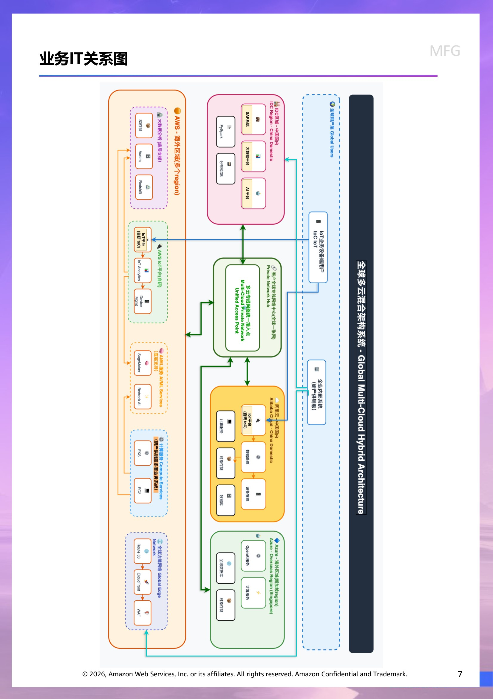
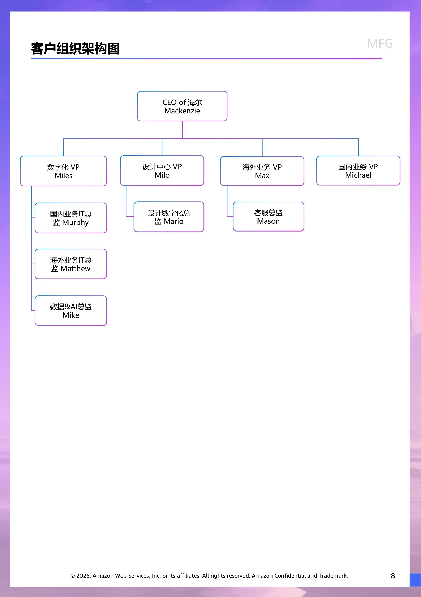

# 客户情报 - MFG

> 此文档面向 Account Team & Manager,所有人可见。
> 内容来源:原 PPT 客户情报章节 (slide 1 至 Roleplay 起始页之前)。

## 客户背景信息  (slide 2)

海尔是为全球用户定制美好生活解决方案的智慧家庭生态品牌商，总部位于中国。公司主要从事冰箱/冷柜、洗衣机、空调、热水器、厨电、小家电等智能家电产品与智慧家庭场景解决方案的研发、生产和销售，通过丰富的产品、品牌、方案组合，创造全场景智能生活体验，满足用户定制美好生活的需求。公司成立至今通过创业、创新，不断适应时代发展。公司在北美洲、欧洲、南亚、东南亚、澳大利亚、新西兰、日本、中东和非洲等超过 200个国家和地区为用户制造和销售全品类的家电产品及增值服务。

在海外市场，公司基于各市场当地消费需求，生产及销售自有品牌的家电产品。公司已具有超过 20 年的海外运营经验。公司也通过收购海外品牌，进一步扩大海外业务布局。从2015年开始收购了一家日本电机公司的日本及东南亚白色家电业务，于2016年收购一家美国公司的家电业务，于2018年收购了一家新西兰公司，并于2019年收购了一家意大利公司。此外，2024年，该企业新增两大并购品牌，其中一个品牌的收购助力该企业大冷链战略推进，拓展了在商用制冷领域的业务版图，为公司欧洲市场发展提供有力支撑的同时，进一步促进亚太等地区商用制冷业务发展；收购南非百年热水器品牌，巩固该企业在热水器领域的业务布局，并进一步促进白电业务快速深入南非市场。

目前公司海外业务已经进入良性发展期，成功实现了多品牌、跨产品、跨区域的全球化布局。根据欧睿数据统计，2024 年公司在全球主要区域大家电市场（零售量）份额如下：在亚洲市场零售量排名第一，市场份额25.9%；在北美洲排名第一，市场份额24.5%；在澳大利亚及新西兰排名第一，市场份额15.9%；在西欧排名第三，市场份额 8%。2024 年， M公司秉承 “为全球家庭定制美好生活” 的使命，强化科技创新能力、深化数字化转型、优化全球战略布局：公司收入、利润创出有史以来最好成绩；战略聚焦和组织变革协调一致，为实现穿越周期的增长铺就坚实的基石。

客户财务基本情况

|  | 2022 | 2023 | 2024 |
| --- | --- | --- | --- |
| 营业收入 | 243,578 | 261,428 | 285,981 |
| 营业成本 | 167,263 | 179,054 | 206,487 |
| 销售费用 | 38,600 | 40,978 | 33,585 |
| 管理费用 | 10,846 | 21,711 | 22,850 |
| 财务费用 | -241 | 514 | 972 |
| 研发费用 | 9,507 | 10,380 | 10,740 |
| 净利润 | 18,741 | 16,732 | 19,576 |
|  |  |  |  |
|  | *单位：人民币百万元 |  |  |

## 财务分析  (slide 3)

2024 年公司实现收入2,859.81 亿元，较2023 年同期增长 9.3%。收入增长原因在于：

中国市场：

积极把握以旧换新政策机会、发挥高端产品与品牌优势，四季度国内收入增长超过两位数、其中收入增长超 30%

深化领先品牌的战略投入，聚焦在年轻消费群体的品牌心智构建，带动品牌收入快速增长

海外市场：在各个区域持续拓展份额，表现优于行业，尤其是东南亚、南亚、中东非等新兴市场通过聚焦高端提升结构、推进零售模式转型，实现快速增长。

通过外延并购与自身变革，加速暖通产业的布局与发展

战略性收购开利商用制冷业务（2024 年 10 月并表）与南非热水器龙头公司（2024 年12 月并表），分别实现拓展商用制冷业务、加速海外市场发展

智慧楼宇产业依托核心技术持续投入与突破、产品平台的不断迭代，2024 年全球收入增长达 15%，规模突破100 亿

把握品质生活升级以及低碳经济转型带来的发展机遇，积极拓展干衣机、洗碗机、净水器、家用清洁机器人以及热泵、再循环等业务，丰富产业布局。

2024 年公司毛利率达到 27.8%，较2023 年同期上升 0.3 个百分点。其中，国内市场持续推进采购、研发及制造端数字化变革、构建数字化产销协同体系，通过产品结构升级、推进场景化体验，提升品牌溢价能力，毛利率同比提升； 海外市场坚定高端品牌战略，聚焦本地化需求，通过搭建采购数字化平台提升成本竞争力、通过全球供应链协同提升产能利用率，毛利率同比提升。

2024 年公司销售费用率 11.7%，较2023 年同期优化 0.2 个百分点。其中，国内市场推进数字化变革，在营销资源配置、物流配送及仓储运营等方面实现效率提升，销售费用率同比优化；海外市场推进终端零售创新、整合全球资源，提升运营效率带来的积极影响受市场竞争加剧，以及在终端渠道拓展、新品上市推广、店面形象升级等投入增加所抵消，销售费用率同比持平。

2024 年公司管理费用率 4.2%，较2023 年同期优化 0.1 个百分点。管理费用率优化得益于公司通过数字化工具，优化业务流程，提升组织效率。

2024 年公司财务费用率 0.3%（费用为“+”，收益为“-”），较2023 年同期下降 0.2 个百分点。原因主要是海外受加息影响利息支出增加，抵消了公司通过提升资金管理效率增加的利息收入。

## 行业趋势  (slide 4)

国内市场

随着2024 年8 月份以来国家家电以旧换新政策的陆续落地，行业逐步摆脱上半年的低迷走势，根据奥维云网（AVC）推总数据，2024 年中国家电全品类（不含 3C）零售额9,071 亿，同比增长6.4%。

目前国内家电市场呈现高保有率、存量市场规模大的特征，换购成已成为需求主要组成部分：根据GfK 中怡康推总数据，2023 年底，中国家电保有量超过69 亿台；66%购买动机为换购，34%购买动机为新增或者增购。随着消费者对于生活品质持续提升、驱动的产品升级有望带来产品价值增长，以及洗碗机、干衣机等品类渗透率提升，整体市场规模未来有望持续增长。《2025 年政府工作报告》指出 2025 年国家将坚定实施扩大内需战略、安排超长期特别国债3,000 亿元支持消费品以旧换新。作为货值高、刚需属性强的白色家电产品将有望继续受益，根据奥维云网等机构预测，2025 年家电行业总体规模有望继续保持增长。

海外市场

根据欧睿数据， 2024 年全球核心家电产品零售额达到2,882 亿美元，同比2.1%；全球小家电产品零售额达到 2,451 亿美元，同比增长 3.1%。发达国家市场在高利率与消费者信心不足的环境下整体增长承压。而新兴市场则凭借空调等产品需求释放、线上渠道增长等实现稳步增长，但同时面临竞争加剧与成本上涨的压力。

整体而言，2025 年海外家电市场将受到全球宏观经济波动及贸易政策变化的影响，但市场仍

具备明确的消费升级趋势及结构性增长机会。企业需密切关注经济和政策动向，通过技术创新、

成本管控和灵活供应链策略，适应不确定性环境，抢占细分市场机会。

北美市场: OECD 预测2025 年美国经济增速为 1.9%，美联储预PCE 通胀率为2.7%，关税政策持续影响消费者可支配收入和企业投资意愿，对家电市场需求形成压力。尽管如此，受制于高通胀背景下的刚性需求，高能效和节能型家电产品预计将持续受到消费者青睐。中长期来看，房贷利率的逐步下行有望推动房地产市场增长，家电行业将从中受益。

欧洲市场: 欧洲经济仍受到俄乌冲突不确定性及能源价格波动的影响，但伴随欧洲天然气价格的逐步下降趋势，家电生产成本及终端售价预计有所回落。尽管贸易不确定性使欧元兑美元汇率面临下行压力，但欧盟财政扩张及潜在的国防支出增加可能缓解部分经济压力。欧洲家电市场预计将继续聚焦可持续发展，绿色环保、高效节能的家电产品预计成为市场主流，厂商在ESG 表现和产品创新方面的竞争将更加激烈。

新兴市场: 新兴市场家电消费需求预计保持稳健增长，其中，东南亚、南亚、中东、非洲等地区的城市化进程加速、中产阶级扩容，将为家电行业创造新的市场机会。但考虑到汇率强劲对通胀的抑制作用，新兴市场央行普遍降息趋势可能推动消费信贷环境改善，进而利好家电消费。

> 演讲者备注:Reseach

## 业务挑战  (slide 5)

业务增长

传统家电业务，尤其是电视和空调产品线，市场竞争力正在减弱。这些曾经为海尔带来丰厚利润的核心业务，如今在市场饱和度不断提高的情况下，增长动力明显不足。数据显示，公司冰洗产品的增速已经放缓至2%左右，较往年下滑了3个百分点以上，这种增长乏力的态势令人担忧。同时，在后疫情时代，发达国家市场需求回落，消费者购买力受到抑制；在新兴市场，通货膨胀和汇率波动削弱了当地消费者的购买能力，使得海尔在这些地区的业务拓展近期面临重重阻力。

全球业务整合

通过多年的国际化战略，海尔已经收购了多家海外企业，形成了覆盖全球的业务网络。然而，如何有效整合这些企业的供应链、研发资源、生产体系，实现协同效应，仍是一个艰巨的任务。多品牌运营策略虽然有助于满足不同市场的需求，但也带来了资源分散、管理复杂化等问题，影响了整体运营效率。此外，在全球化背景下，如何提供符合各地消费者期望的本地化服务，也是海尔必须面对的重要课题。

数字化转型

组织架构复杂，业务遍布全球，导致数据整合难度极大。在智慧家庭场景应用和产业互联网平台建设方面，海尔面临着技术升级的迫切需求。如何利用大数据、人工智能等前沿技术提升产品智能化水平，如何构建高效的数字化管理体系，都是海尔亟待解决的问题。尽管海尔在物联网战略上有所布局，但转型过程中的投入巨大，短期内难以看到显著回报，这给公司财务表现带来了一定压力。

销售渠道转型

随着电商、社交电商等新兴渠道的快速发展，传统的线下销售模式受到了前所未有的冲击。海尔需要加速推进线上线下一体化战略，提升全渠道服务水平。然而，这一转型过程中，如何平衡各渠道利益，如何提高线上获客能力，如何优化物流配送效率，都是需要解决的难题。高昂的销售费用率远高于主要竞争对手，反映出海尔在渠道建设和营销效率方面存在明显短板。

智能化升级

随着消费升级趋势的深入，高端市场对产品智能化、场景化的需求日益增长。海尔需要不断提升智慧家庭解决方案的技术集成和服务能力，打造真正满足用户需求的智能生态系统。然而，IoT设备连接和数据应用存在较高的技术门槛，需要持续的研发投入和技术积累。虽然海尔通过高端品牌布局高端市场，但在品牌影响力和产品体验方面与国际一线品牌相比仍有差距，用户反馈的质量和服务问题也影响了品牌形象。

面对这些挑战，海尔已经启动了新一轮管理团队调整，希望通过组织变革激发企业活力。然而，新管理层能否有效应对这些复杂的商业挑战，仍需时间检验。在全球经济不确定性增加、行业竞争加剧的背景下，海尔需要更加精准的战略定位，更加高效的运营管理，以及更加创新的商业模式，才能突破当前的发展瓶颈，重新找到可持续增长的动力源泉。

> 演讲者备注:Reseach

## 客户现有战略方向  (slide 6)

持续深化数字化变革、实施极致成本项目，提升全流程成本与费用竞争力

市场端

计划在市场端，通过持续升级模式提升经营能力。

（1）计划升级线下渠道模式。将积极把握国补机会，在线下渠道上线店OTO模式，目标覆盖超2万家门店，计划创造零售金额4.5亿元。

（2）计划推进营销全链路数字化，旨在提升新媒体矩阵运营、智能内容创作及商机管理的能力，目标实现新媒体曝光超14亿人次、商机转化率24.7%。

服务中台

计划通过智能化工具应用优化资源配置，提升服务效率与用户粘性。

（1）计划在客户服务环节建立智能客服能力，通过构建客服知识库体系、交互场景标准化体系等，以及智能交互解决等能力，目标2024年智能交互占比同比上升25.52%，智能解决率同比提升10.35%。

（2）在售后服务环节，计划建设智能排程调度、全程在线赋能、备件全链路数字化等能力，目标使用户抱怨同比下降33.22%，服务费用下降5.2%。

供应链平台

计划构建智能化预测能力，实现市场订单的敏捷响应。将拉通企划、市场、制造、采购、物流等节点构建算法驱动的智能化预测模型和智能分析的云脑运营体系，提升订单预测能力。计划建立T+6周内预排产信息可视可用，自动补货、智能评审的能力，提升按需交付效率。目标2024年国内定单响应周期优化13%；客户资金占用周期下降7天。

海外市场

计划复制国内数字化模式，提升海外区域竞争力和盈利能力。

（1）计划在泰国、中东非等区域建立海外客户体验平台，实现定价政策、终端销售等内容的线上化。

（2）计划在海外17家工厂落地数字化系统，提升在采购策略，生产计划、制造执行、原材料仓储、成品仓储管理等能力。

（3）在客服领域，计划依托AI大模型，实现客户问题的智能处理。

客户的现有 IT 供应商情况

|  | 供应商 | 供应商 |
| --- | --- | --- |
| To C 产品 IoT 平台 | 阿里云 | AWS ((海外) |
| SAP | IDC (国内) | Azure (海外) |
| 大数据平台 | IDC (国内) | Azure (海外) |
| AI 平台 | IDC (国内) | Azure (海外) |
|  |  |  |
|  |  |  |
|  |  |  |
|  |  |  |

## 业务IT关系图  (slide 7)

> 演讲者备注:目前不清楚内部的自建云架构不清楚

## 客户组织架构图  (slide 8)

> 演讲者备注:Mark, Murphy, Marco,, Macy,
