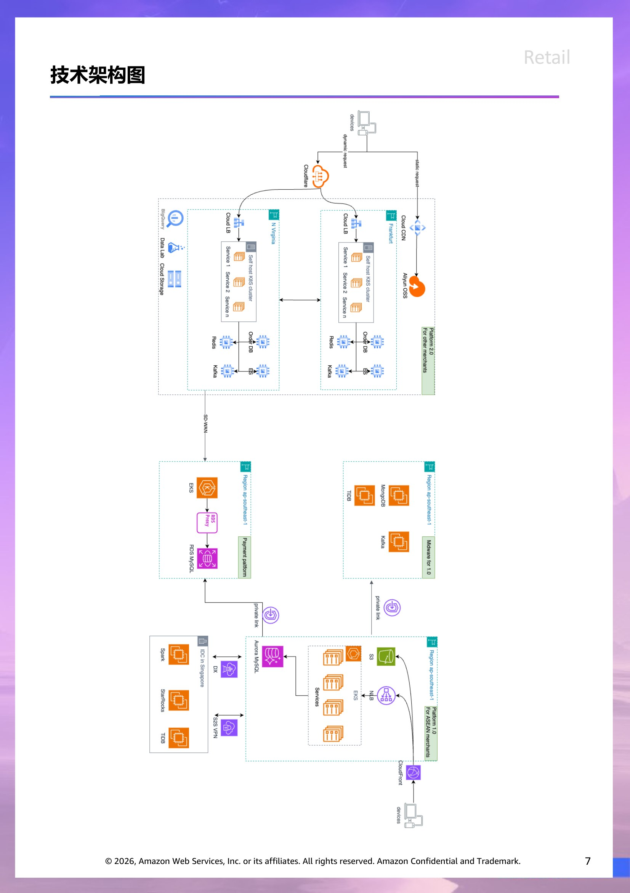
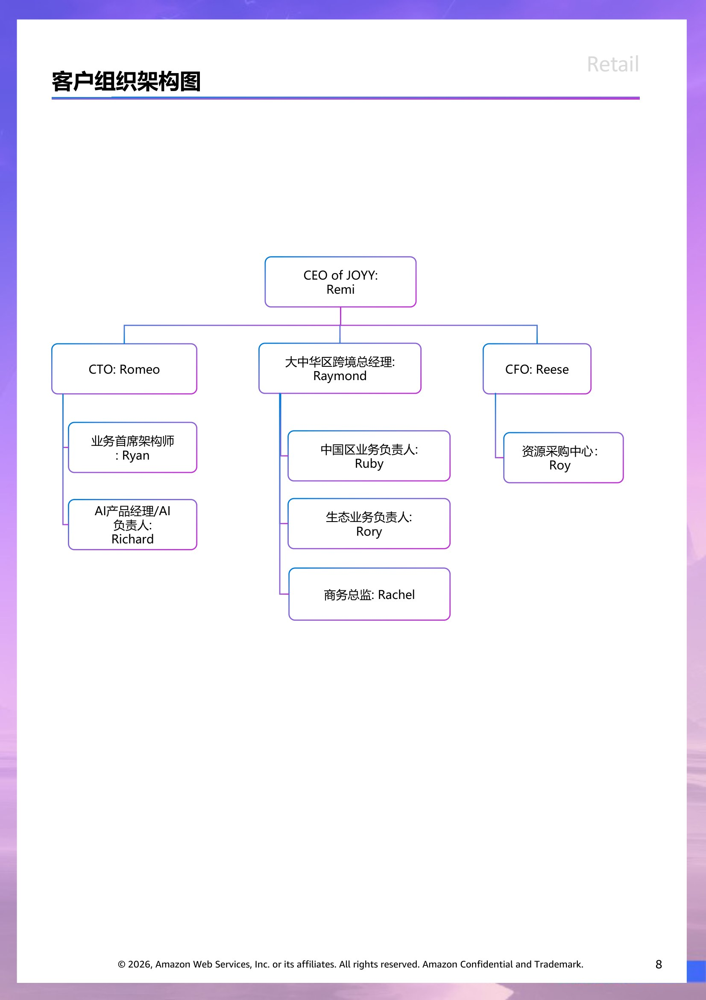

# 客户情报 - RETAIL

> 此文档面向 Account Team & Manager,所有人可见。
> 内容来源:原 PPT 客户情报章节 (slide 1 至 Roleplay 起始页之前)。

## 客户背景信息  (slide 2)

在跨境电商业务中，有的商家选择在第三方交易平台开店，而有的商家则选择搭建自己的品牌独立站。然而，随着竞争加剧，商家们开始意识到，第三方平台（Amazon和eBay等）规则和限制多，难以积累长期的品牌价值，纷纷开始布局自由度较高的独立站业务。得益于庞大的市场需求，国外和本土的各种类型的独立站SaaS服务商也应运而生。JOYY就是其中的典型代表。

JOYY创立于移动互联网时代，搭乘上了中国商家出海的大浪潮，发展迅速。全球范围内服务的商家为60余万。相较于自建站，SaaS建站平台通过低成本建站、生态集成（多渠道/支付/物流/税务/库存）与合规支持，大幅降低了商家的技术门槛，推动跨境电商从“平台依赖”向“品牌驱动”的转型。致力于为每个人打造更好的商务体验，通过让商家更轻松地开展和经营业务，并促进业务增长，帮助大家实现自我目标。

JOYY最初的总部位于中国香港，即使现在的总部是新加坡，在中国也有专门的办公室。从某种意义来说，JOYY是创立于国内的独立站服务平台。此外，网站标语为“更懂中国商家，服务全球市场”。对于中国的独立站出海商家而言，JOYY具备了语言和时效等方面的本地化优势，例如，提供中文视频教程和提供无时差的中文服务等。

JOYY允许商家通过一个主账号来管理多个店铺。这意味着，商家无需频繁切换账号，即可在管理员页面查看并管理所有店铺的数据及订单信息。这一功能不仅节省了时间，还降低了操作复杂度，让店铺管理更加省心、高效。此外，JOYY还支持将一个店铺的主题模板、商品信息、物流设置信息等数据快速复制到另一个店铺，极大地降低了新开店铺的准备工作量，商家因此而能够快速、轻松地扩展业务。

在营销推广上，JOYY内置了一套 AI 智能投放系统，可以基于各品类投放模型为商家自动适配投放策略。除了智能投放，平台还提供广告代投服务，还有从媒体选择、账号养护到广告投放和策略优化的一对一人工辅导。此外，JOYY的应用商店提供了超过200款应用，功能也较为齐全，也能满足跨境电商运营的各项需求。

年轻消费者的购物渠道逐渐多元化。相比之下，独立站凭借更高的运营自由度和对DTC 模式（直接面向消费者）的适配优势，成为越来越多国内商家出海的首选模式。

## 业务挑战  (slide 3)

市场业务挑战：关税动荡、流量成本与合规风险

关税政策冲击跨境电商利润：2024&2025年美国关税政策调整导致中国出口商品成本激增，部分品类税率涨幅达10%-20%。服装、配饰等品类卖家被迫提价，但销量未明显下滑，表明市场存在一定承受力。然而，依赖低价策略的平台型卖家（如SHEIN、Temu）受冲击最大，广告投入和单量双降，倒逼行业从“规模导向”转向“品牌溢价”模式。尤其在2025年上半年时间，美国关税的突增突减的变化，对行业产生巨大不确定性。JOYY营收来自品牌卖家的交易抽佣与平台费用，因此行业变化会直接影响JOYY的模式与拓展区域选择。

流量成本飙升与竞争加剧：独立站流量成本年均涨幅超15%，中小卖家获客难度显著提升。Temu凭借“免运费+无门槛折扣”策略，上线两月即登顶美国购物类App下载榜，日均GMV破150万美元 (GMV 代表商品交易总额 Gross Merchandise Volume, 指的是在一定时间内，一个电商平台或零售商所售出商品的总价值。GMV 能够反映平台的交易规模和市场占有率，是衡量电商平台活跃度和销售业绩的重要指标）。加剧行业低价内卷。同时，亚马逊中国卖家份额从2020年的48%降至2024年的42%，封店潮迫使卖家寻求多渠道布局。多渠道布局其中之一就是建立各自的品牌独立站，JOYY能获取更多的客户，但同时相对的竞争压力也持续增加。

合规与用户留存压力：平台规则趋严（如亚马逊封店潮冻结资金超1.3亿元），叠加用户忠诚度下降——仅56%的用户愿为忠诚品牌支付溢价。独立站需通过精细化运营提升复购，数据显示老客复购成本比新客低30%，转化率高50%。作为电商的平台方，JOYY不仅需要为自身保证合规性，还需要进一步保障各个品牌卖家的数据合规性与可靠性。

发展问题：生态整合不足与数据工具缺口

物流与支付环节短板：传统国际货运存在信息不透明、流程冗长问题，中小卖家因货量不稳定难以获得优质服务，被迫承担高达行业均值1.5倍的物流成本。支付环节亦面临成功率低、风控难问题，行业平均支付成功率仅80%，影响转化率。尽管JOYY已经在支付渠道成立 R-Payments, 在物流渠道成立 R-Logistics，但仍旧因为各地政治地缘信息的不同，没法广泛铺开，仍需要依赖当地渠道支持。

商家运营效率低下：独立站运营高度依赖专业化人才，但行业面临“缺流量、缺人才”双重痛点。平台卖家转型独立站时，因团队技能错配（平台重选品、独立站重流量），导致运营真空期延长。例如，北京秀美在迁移至JOYY前，复购率提升遇阻，需增设用户运营团队重构策略。但JOYY缺乏团队进行培养这类运营人员帮助商家构建独立站，因此除了平台能力提供，还需要商家自身具备充分的独立站运营能力才能发展更好。

数据驱动能力薄弱：超60%卖家凭经验组合商品，缺乏关联销售数据支持。JOYY调研显示，商品关联率是GMV提升关键，但低关联组合导致页面停留时长缩短15%，浪费曝光机会。JOYY能提供更好的数据展示和营销能力，但如何更好组合和为商家独立站服务，需要更直接的推动。

> 演讲者备注:Reseach

## 行业趋势  (slide 4)

全球电子商务市场呈现显著增长态势，2023年市场规模约达8.1万亿美元，预计到2030年将增至18.7万亿美元，预测期内复合年增长率(CAGR)达14.8%。此增长主要受互联网普及率提高、智能手机应用广泛化以及COVID-19疫情加速的消费者偏好转变所驱动。电子商务格局预期将继续演变，主要平台间整合加剧，而利基直接面向消费者(DTC)企业则专注于特定品类与体验。支付方式创新、配送自动化及沉浸式购物体验等技术革新将定义行业下一阶段发展。根据Grand View Research数据，全球DTC市场2023年规模约达1750亿美元，预计至2030年将保持19.4%的复合年增长率，超越传统电子商务增速。在此背景下，JOYY作为SaaS解决方案提供商，将持续在电子商务行业中发挥重要作用，为商户业务扩展提供支持。

市场主导格局持续塑造竞争环境，亚马逊与阿里巴巴占据全球电子商务交易总额约40%，为独立DTC品牌创造日益严峻的经营挑战。同时，获客成本压力不断上升，数字渠道客户获取成本(CAC)同比增长43%，迫使DTC品牌寻求超越传统付费获客的替代增长策略。全渠道整合已成为必然趋势，73%成功DTC品牌现采用数字/实体混合策略，纯线上模式日渐式微。此外，垂直整合趋势日益明显，领先DTC品牌加强供应链控制，35%现拥有或共同拥有制造能力，以优化成本结构并提升产品差异化。订阅模式也呈现饱和迹象，DTC订阅服务增长率从2022年的23%下降至2024年的12%，表明该细分市场成熟度提高及消费者疲劳现象日益显著。

生成式人工智能应用在电子商务领域呈现普及趋势，78%电子商务平台现采用AI驱动个性化，相比非个性化体验，这些系统展示了平均29%的转化率提升。这种技术应用不仅优化了消费者体验，还提高了运营效率和营销精准度。JOYY作为行业领先的SaaS解决方案提供商，也密切关注生成式AI应用场景并积极开展实验，旨在为商户提供更智能、更高效的电子商务工具，助力其在竞争日益激烈的市场环境中保持增长动力。随着技术持续演进，AI驱动的个性化、预测分析和自动化将成为电子商务成功的关键差异化因素。

> 演讲者备注:Reseach

## 客户现有战略方向  (slide 5)

技术驱动效率升级

智能分析工具效能优化：推出专有"商品洞察报告"系统，通过用户行为关联分析（基于7日内访问及加购行为）与页面路径连带分析，显著提升组合销售精准度，特别适用于服装及3C电子等多元品类。

支付与物流系统升级：自主研发”R-Payments"支付解决方案，交易成功率较行业平均水平提升20%；同时成立专业科技货运事业部，实现物流全链路可视化管理，中小规模卖家订舱效率提升30%。

生成式人工智能建站方案：整合GenAI技术，提供一键式建站功能，满足快速铺货商户需求；应用文本生成图像及图像转换技术，构建个性化风格与节日主题品牌站点；配备智能客服、AI虚拟模特及智能上架助手等功能，正规划进一步商业化应用。

生态协同与资本布局

品牌孵化战略合作：参与全球电子商务联合消费品投资基金，计划于2025年前投资100个新兴品牌，提供全套电商工具与供应链整合支持。

全渠道商业整合：推出Unified Commerce综合解决方案，支持多市场本地化运营策略。成功案例：德国品牌Out of Style平台迁移后4个月内，毛利率提升至56%，广告投放转化效率增长146%。

市场本地化深度适配：于欧美及东南亚等关键市场建立专线物流网络，优化适配当地清关规范与要求。

专业客户成功体系：构建"教练式服务团队"，全面覆盖建站、营销投放及订单履约等核心环节。实证成果：服装类商户借助会员系统实现复购率提升超过20%。

## 客户的现有 IT 供应商情况  (slide 6)

客户财务基本情况

|  | 供应商1 | 供应商2 |
| --- | --- | --- |
| 收费平台 | AWS | IDC |
| Platform 1.0 for ASEAN merchants | AWS | IDC |
| Big Data | IDC |  |
| Platform 2.0 for all other region merchants | GCP | Aliyun |
| Big Data | GCP |  |
| App Deployment - China | AWS |  |
| 营销平台 | Aliyun |  |
| 物流平台 | GCP |  |

|  | 2022 | 2023 | 2024 |
| --- | --- | --- | --- |
| Total revenues | 279 | 309 | 332 |
| Gross profit | 209 | 235 | 255 |
| Total operating cost and expenses | 349 | 307 | 297 |
| Sales and marketing | 141 | 140 | 129 |
| Research and development | 88 | 83 | 80 |
| General and administrative | 69 | 58 | 61 |
| Amortization of intangible assets | 8 | 8 | 9 |
| Acquisition related costs | 35 | 10 | 1 |
| Restructuring charges | 7 | 6 | 13 |
| Net loss | (139) | (64) | (27) |
|  |  |  |  |
|  | *单位：美元百万元 |  |  |

## 技术架构图  (slide 7)

> 演讲者备注:目前不清楚内部的自建云架构不清楚

## 客户组织架构图  (slide 8)

